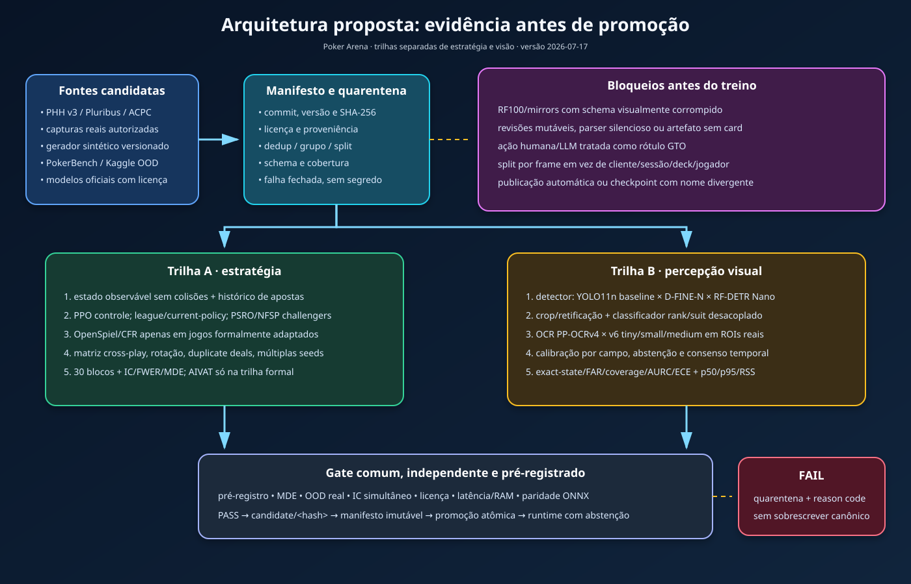

# 🃏 Poker Arena

Jogo próprio de **Texas Hold'em No-Limit** (mesa de até **9 jogadores**) onde um
humano enfrenta bots de **inteligência selecionável** — do aleatório a uma política
neural experimental. Projeto de pesquisa sobre jogos de informação imperfeita, visão
computacional e engenharia de software verificável.

Esta é a única solução canônica do workspace e foi preparada para execução local em uma
banca acadêmica. Metadados de citação, contribuição, segurança e licenciamento estão em
[`CITATION.cff`](CITATION.cff), [`CONTRIBUTING.md`](CONTRIBUTING.md),
[`SECURITY.md`](SECURITY.md) e [`LICENSE`](LICENSE). O reconhecimento F1 é diagnóstico;
somente um F2 com recibo de validação externa válido pode autorizar uma decisão.

> **Modo Laboratório** — o grande diferencial: você monta uma mesa só de bots,
> escolhe o "cérebro" de cada cadeira e **compara os paradigmas de IA ao vivo**,
> com as cartas abertas. Cada jogada mostra, em **caixa de vidro**, *como aquele
> cérebro calculou* — a equity estimada, as opções consideradas e seus critérios.

---

## 🧠 Até 5 perfis de IA

Fonte única no backend (`available_levels()`); o Expert só aparece quando o artefato
passa pelo manifesto fail-closed: status aprovado/promovido, arquivo instalado, SHA-256,
licença/linhagem e contrato de tensores compatíveis.

| Nível | Nome | Estratégia/sinal implementado |
|---|---|---|
| `random` | 🟢 **Iniciante** | joga no chute — linha de base |
| `heuristic` | 🟡 **Amador** | força da mão por regras (par, cartas altas, naipe) + pot odds |
| `montecarlo` | 🟠 **Intermediário** | simula centenas de finais de mão → **equity** vs pot odds |
| `adaptive` | 🧠 **Adaptativo** | força da mão **+ leitura do humano** (explora quem desiste/paga demais) |
| `expert` | 🔴 **Expert** | política neural ONNX experimental; o nível fica indisponível enquanto o peso estiver em quarentena |

Cada bot expõe os sinais usados pela sua implementação. Essas explicações não são
prova de optimalidade; consulte os model cards e os benchmarks antes de comparar força.

---

## ✨ Destaques da experiência (frontend)

- **Dashboard "Lab científico"** — mesa de cassino (feltro verde + posições reais)
  cercada por painéis analíticos.
- **"Como o competidor está pensando"** (Modo Laboratório) — instrumentação da estratégia
  a cada jogada, incluindo equity quando aquela implementação a calcula e uma explicação
  didática da ação. O painel não é interpretabilidade causal de uma rede neural.
- **Sua jogada** (Modo Jogar) — equity multiway, outs/projetos, pot odds, EV, a nut,
  textura do board e o conselho dos níveis de IA efetivamente disponíveis.
- **Placar, Estilo de cada IA (VPIP/agressão) e Corrida das fichas** — estatísticas
  ao vivo, cada competidor com **cor própria** consistente em toda a tela.
- **Posições de poker** (SB, BB, UTG, UTG+1, MP, LJ, HJ, CO, BTN) nos assentos +
  **guia de regras por posição** (clique na sigla).
- **Gerenciar mesa** — sente/retire jogadores ao vivo, no nível que quiser.
- **Auditoria** — toda partida é gravada; o replay paginado dá acesso a todas as mãos sem
  carregar o histórico inteiro em uma única resposta.
- **Guia dos Cérebros** — explicação didática (estilo *Use a Cabeça*) de cada nível.

---

## ✅ Fidelidade às regras oficiais

Motor coberto por testes determinísticos, invariantes gerativos e 16 cenários
diferenciais independentes contra PokerKit: blinds e rotação do botão, heads-up, ordem de ação (UTG pré-flop
/ SB pós-flop), **aumento mínimo e full-raise**, **all-in incompleto não reabre a
aposta** (TDA 47 / WSOP 96), **side pots**, burn cards, showdown (melhor de 5 em 7),
ranking de mãos, opção do big blind e fichas indivisíveis distribuídas, no máximo uma por
vencedor, em ordem a partir do primeiro vencedor à esquerda do botão. Essa house rule segue
[Robert's Rules of Poker](https://www.pagat.com/de/docs/RobsPkrRules11.pdf); PokerKit concentra
múltiplas sobras no primeiro vencedor, portanto a igualdade diferencial de stacks exclui
deliberadamente esse caso de interoperabilidade. As cartas são
embaralhadas com **aleatoriedade criptográfica** (`SystemRandom`) fora de testes.
O diferencial atual cobre NLHE sem ante, rake, straddle ou múltiplos boards; não é
uma certificação formal de todas as regras possíveis.

---

## ▶️ Como rodar (Windows)

**Jeito fácil:** duplo-clique no ícone **POKER** na Área de Trabalho (ou em
[`POKER.bat`](POKER.bat) na raiz) → menu:

```
[1] Iniciar   (backend + frontend + navegador)
[2] Parar     (encerra os servidores)
[3] Abrir no navegador
[4] Validar   (testes + build + lint)
[5] Preflight banca (offline + visão + segurança)
```

Antes da apresentação local, execute a opção **5** e prossiga somente se ela imprimir
`READY_FOR_LOCAL_DEFENSE`. O roteiro completo está em
[`docs/ROTEIRO_BANCA.md`](docs/ROTEIRO_BANCA.md).

As opções **Iniciar** e **Abrir no navegador** usam
`http://127.0.0.1:5173/?view=capture`: a aplicação abre diretamente o workspace de captura
  do Copiloto. Autorize, escolha **Janela**, confira a prévia e confirme a fonte. Tela inteira,
  guia e origem que o navegador não consiga identificar são bloqueadas por privacidade. O F1
  local e o VLM não calibrado exibem somente propostas diagnósticas e nunca autorizam decisão;
  apenas um F2 com receipt externo válido pode fazê-lo. Nenhum quadro é enviado antes da
  confirmação. No modo de
  apresentação aparecem percepção, confiança interna, latência e abstenção — não recomendação
  estratégica. O seletor sempre exige ação humana por segurança do navegador.

Guia visual para operação e apresentação: [`GUIA_DE_NAVEGACAO_POKER_ARENA.pdf`](docs/GUIA_DE_NAVEGACAO_POKER_ARENA.pdf).

Guia pedagógico, visual e interativo sobre toda a solução:
[`GUIA_PEDAGOGICO_POKER_ARENA.html`](docs/GUIA_PEDAGOGICO_POKER_ARENA.html).

**Manual:** em dois terminais abertos na raiz do projeto:

```powershell
# terminal 1 -> http://127.0.0.1:8000/docs
cd backend
uv run uvicorn poker_arena.api.app:app --host 127.0.0.1 --port 8000
```

```powershell
# terminal 2 -> http://localhost:5173
cd frontend
npm.cmd ci
npm.cmd run dev
```

---

### Exposição pública

O modo local continua preso ao loopback. Para uma implantação pública existe um perfil
separado e fail-closed em [`deploy/production/`](deploy/production/README.md): NGINX como
única entrada, TLS 1.2/1.3, login individual OIDC via oauth2-proxy, limites de taxa e
conexão, suporte WSS e segredo interno proxy-backend vindo de arquivo externo. O backend
recusa iniciar esse perfil com origem HTTP, host wildcard, segredo ausente ou fonte
ambígua. O desenho e os trade-offs estão no
[ADR-0004](docs/adr/0004-perfil-publico-proxy-auth-tls-rate-limit.md).

Esse perfil é implementação de referência, não homologação automática: certificado,
IdP, imagens por digest, scan/SBOM, handshake, login/MFA, carga e pentest precisam ser
validados no ambiente de destino. Nenhuma credencial é fornecida pelo pacote. As mesas e
os logs ainda pertencem ao workspace compartilhado, não a um usuário; este perfil não
autoriza uso multi-tenant entre partes mutuamente desconfiadas.

---

## 📘 Documentação da API — pasta [`api-docs/`](api-docs/)

- **Versão do contrato:** `0.2.0`.
- **Swagger ao vivo:** http://127.0.0.1:8000/docs (com o backend rodando).
- **Swagger offline:** `api-docs/swagger.html` (abre por duplo-clique).
- **Insomnia:** importe `api-docs/insomnia.json` (todos os serviços em pastas).
- **OpenAPI:** `api-docs/openapi.json`. Regenera com `uv run python ../api-docs/generate.py`.
- **Proveniência offline:** Swagger UI `5.17.14`, licença/notice upstream e hashes
  fixados em [`api-docs/vendor/receipt.json`](api-docs/vendor/receipt.json).

### Endpoints
| Método | Rota | O que faz |
|---|---|---|
| `POST` | `/copilot` | revisa um spot descrito, localmente e após o jogo |
| `POST` | `/copilot/from-image` | propõe estado a partir de screenshot e abstém quando o gate reprova |
| `POST` | `/copilot/review-hand` | revisa o subconjunto PHH-NLHE com valores inteiros; não cobre todas as variantes PHH |
| `POST` | `/tables` | cria a mesa (cérebros, blinds, formato, modo) → devolve o `table_id` |
| `GET` | `/tables/{id}` | estado atual da mesa |
| `POST` | `/tables/{id}/actions` | sua jogada (`fold/check/call/raise/all_in`) |
| `POST` | `/tables/{id}/step` | avança 1 jogada de bot (Modo Laboratório) |
| `POST` | `/tables/{id}/next-hand` | próxima mão |
| `POST` | `/tables/{id}/players` | senta um novo bot |
| `DELETE` | `/tables/{id}/players/{seat}` | remove um jogador |
| `GET` | `/levels` · `/games?offset&limit` · `/games/{id}?offset&limit` | catálogo e auditoria paginada |
| `GET` | `/health` · `/ready` | liveness e prontidão/dependências opcionais |
| `POST` / `DELETE` | `/copilot/remote-vlm/consent-sessions` | cria/revoga consentimento remoto efêmero |
| `WS` | `/tables/{id}/ws` | estado em tempo real (push a cada ação) |

Erros do domínio viram HTTP: inexistente → **404**; ação ilegal/inválida → **400**;
conflito de versão/idempotência → **409**. Upload de imagem rejeitado por tamanho ou tipo
retorna **413** ou **415**; mutação cross-site de navegador retorna **403**. `/ready` e o
recurso de consentimento podem retornar **503** quando o VLM remoto foi habilitado, mas
está incompleto. Corpos, parâmetros e cabeçalhos que não satisfazem o schema
OpenAPI retornam **422**; esse erro de contrato é distinto de uma ação de poker ilegal.
Criação e mutações de mesa aceitam `Idempotency-Key`; nas mutações de uma mesa existente,
`If-Match` protege contra versão obsoleta e a resposta expõe `ETag`/versão. `POST /tables`
rejeita `If-Match`, pois ainda não existe sessão. Rotas de copiloto, imagem e consentimento
não prometem esse contrato idempotente. `POKER_API_TOKEN` ativa o token compartilhado e,
sempre que definido, deve ter 32–512 caracteres ASCII imprimíveis; um valor inválido
bloqueia as rotas protegidas e degrada `/ready`. A interface aceita digitá-lo, mas o mantém
apenas em memória (não em URL ou storage). O fallback VLM remoto exige ainda consentimento
emitido pelo servidor com TTL e revogação. Requisições mutáveis de navegador com origem
externa ou `Sec-Fetch-Site: cross-site` são bloqueadas. No perfil local, CORS/WebSocket
aceitam apenas origens locais; no perfil público, aceitam somente a origem HTTPS exata
declarada e exigem a identidade individual e o segredo interno injetados pelo proxy. O
backend não deve ser publicado diretamente: TLS, login e rate limiting pertencem ao
gateway de produção.

Assentos e placares usam `player_id` como identidade imutável na sessão; o número da
cadeira pode mudar. Em conflito `409`, a interface relê o estado atual antes de aceitar
outra decisão. A corrida de fichas ao vivo envia uma janela de até 500 pontos e informa
quando houve truncamento; a Auditoria paginada preserva o acesso ao histórico completo.
As respostas idempotentes recentes são mantidas em uma janela de 256 comandos por mesa
e suas chaves permanecem protegidas por uma janela adicional de 4096 tombstones: uma
repetição expirada falha com `409`, sem executar a mutação novamente. Cada comando é
atômico também em relação ao log de auditoria; se a persistência falhar, estado, métricas,
RNG e arquivo retornam ao checkpoint anterior, e uma falha no próprio rollback torna a
sessão indisponível (`503`) em vez de permitir continuidade inconsistente.

---

## 🗂️ Estrutura (monorepo)

```
backend/          API + motor + bots (Python, Clean Architecture)
  poker_arena/
    engine/       domínio: regras do poker (Hand, Table, cartas, avaliador, posições)
    bots/         domínio: cérebros (Strategy) + observação filtrada por assento
    application/  use cases: GameSession (Facade), BotFactory, análise, raciocínio, stats
    api/          interface: FastAPI (REST + WebSocket), schemas, ACL/mappers, DI
  tests/          unidade + integração (pytest)
frontend/         mesa + dashboard em React + TypeScript (Vite)
api-docs/         Swagger (openapi.json + swagger.html) + projeto Insomnia
assets/           ícone do app + scripts (start.ps1, stop.ps1, validar.ps1)
ml/               notebooks experimentais de treino/avaliação — destinados ao Colab
```

---

## 🏛️ Arquitetura — Clean Architecture

Dependências apontam **para dentro**. O domínio não conhece ninguém; a web conhece
tudo. Trocar FastAPI por outra coisa não toca no motor.

```
  api/  (FastAPI, Pydantic, DI)              ← detalhes externos
   ↓ depende de
  application/  (GameSession, Factory, Repo) ← casos de uso
   ↓ depende de
  engine/ + bots/  (regras puras do poker)   ← domínio (núcleo)
```

### Design Patterns aplicados
| Padrão | Onde | Por quê |
|---|---|---|
| **Strategy** | `bots/` (interface `Bot`) | cada cérebro é uma estratégia intercambiável |
| **Factory** | `application/bot_factory.py` | cria o bot a partir do nível (OCP) |
| **Repository** | `application/session_repository.py` | guarda sessões atrás de uma interface (DIP) |
| **Facade** | `application/game_session.py` | esconde a orquestração motor+bots |
| **Anti-Corruption Layer** | `api/mappers.py` | traduz domínio ↔ web sem vazamento |
| **DTO** | `api/schemas.py` + `application/views.py` | contratos de dados explícitos |
| **Adapter** | `bots/observation.py` | adapta `Bot` ao loop do motor |
| **CQRS-lite** | `GameSession` (comandos vs `view()`) e API (POST vs GET) | separa escrita de leitura |

### Diretrizes SOLID

O desenho busca SRP nos módulos, extensão por novas estratégias de bot, substituição pelas
interfaces `Bot`/`Repository`, interfaces pequenas e dependência sobre abstrações. Isso é
uma intenção arquitetural sustentada por testes, não uma certificação formal de conformidade
SOLID para toda mudança futura.

As fronteiras de integridade científica, atomicidade/idempotência e contrato de API são
normativas e estão registradas em [`docs/adr/`](docs/adr/README.md).

---

## ⏱️ Análise assintótica (Big O)

`P` = jogadores (≤9), `N` = amostras de Monte Carlo.

| Operação | Complexidade |
|---|---|
| Avaliar mão (`treys`) | **O(1)** (perfect-hash) |
| `legal_actions` / `round_complete` | **O(1)** / **O(P)** |
| `build_side_pots` | **O(P²)** (P≤9 → trivial) |
| `MonteCarloBot.estimate_equity` | **O(N·P)** — mais N = estimativa melhor |
| `Repository.get/add` | **O(1)** |

---

## 🔬 Qualidade e validação

Rode a opção **[4] Validar** no launcher, ou:
```bash
cd backend
uv run pytest -q
cd ../frontend
npm test && npm run build && npm run lint
npm run test:e2e
```

- **Testes:** unidade + **integração** (API via `TestClient`) no backend; componentes
  (`@testing-library`) no frontend; e navegação E2E com Playwright contra backend e build
  reais em portas locais isoladas. O E2E requer Microsoft Edge instalado, salvo se
  `PLAYWRIGHT_CHANNEL` selecionar outro canal já disponível.
- **Regras do poker** cobertas por testes (side pots, all-in incompleto, full-hand).
- Os painéis de produção derivam dados do motor; a suíte usa mocks apenas em fronteiras
  externas para testar falhas, cancelamento e contratos de forma determinística.
- Pytest e Playwright usam runtimes locais únicos; o E2E recompila a UI e passa aos
  processos filhos apenas variáveis operacionais permitidas, sem herdar tokens ou modelos
  do shell. O gate agregado aplica timeout finito e encerramento em árvore a cada etapa.
- O gate também aplica regras estáticas de segurança e procura credenciais de provedores,
  chaves privadas e atribuições suspeitas em código, documentos e notebooks sem imprimir
  o valor encontrado.

Os comandos acima são úteis para execução dirigida. O gate agregado e autoritativo do
checkout é [`assets/validar.ps1`](assets/validar.ps1); uma contagem histórica de testes não
substitui a saída da execução atual. A execução consolidada, o escopo E2E, as correções
verificadas e os limites que ainda impedem alegações científicas mais fortes estão no
[`relatório de evidências de QA de 2026-07-18`](docs/QA_EVIDENCE_20260718.md).
O parecer vigente da distribuição preparada para apresentação, com cobertura T01–T80,
silent-bug hunt S01–S36 e refutação independente, está no
[`relatório Omega de 2026-08-07`](docs/RELATORIO_OMEGA_AUDITORIA_20260807.md).

---

## 🤖 Machine Learning (`ml/`)
Receitas experimentais destinadas a **Colab** (treino na nuvem; o backend carrega o
checkpoint ONNX do Expert apenas quando manifesto, hash, linhagem, licença e contrato
local passam juntos). As demonstrações
de CFR/NFSP ficam restritas aos jogos pequenos em que suas hipóteses se aplicam. Políticas
NLHE 6/9-max **precisam** de cross-play, rotação de assentos e intervalos de confiança;
esses requisitos não autorizam, por si sós, alegação de GTO. Inventário e limites:
[`ml/README.md`](ml/README.md),
[`docs/DATASET_GOVERNANCE.md`](docs/DATASET_GOVERNANCE.md) e
[`backend/models/`](backend/models/).

## Estado da arte e arquitetura de pesquisa

O levantamento datado, com separação entre evidência e recomendação, está em
[`docs/research/STATE_OF_ART_20260717.md`](docs/research/STATE_OF_ART_20260717.md). A
varredura auditável das 156 plataformas do catálogo, incluindo Ásia, Índia, Rússia e
Canadá, está em
[`docs/research/PLATFORM_SWEEP_20260717.md`](docs/research/PLATFORM_SWEEP_20260717.md).
O follow-up regional fora do catálogo, incluindo J-STAGE, CPRG/Canadá, HSE/Rússia e
fontes indianas, tem [receipt próprio](docs/research/evidence/regional_platform_supplement_20260717.md).
As consultas públicas metadata-only ao Kaggle/Hugging Face também têm
[snapshot reproduzível e sanitizado](docs/research/evidence/catalog_search_snapshot_20260718.md).
O diagnóstico reproduzível em screenshots públicos, incluindo proveniência, gabarito,
erros observados e ganho de latência sem relaxar a abstinência, está em
[`docs/research/PUBLIC_TABLE_IMAGE_CHECK_20260718.md`](docs/research/PUBLIC_TABLE_IMAGE_CHECK_20260718.md);
o contrato legal/técnico do runner está em
[`docs/PUBLIC_IMAGE_DIAGNOSTIC.md`](docs/PUBLIC_IMAGE_DIAGNOSTIC.md).


