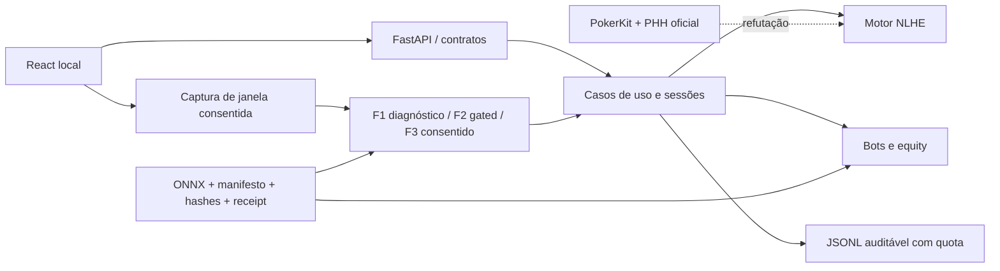

# Relatório Omega de auditoria total e refutação independente — 2026-08-07

## 1. Resumo executivo

Este documento registra a execução do protocolo
`PROMPT_OMEGA_AUDITORIA_UNIVERSAL_TODOS_TIPOS_ERROS_TECNOLOGIA_TRIPLE_CHECK_20260807.md`
sobre a solução canônica `CODEX`. A revisão cobriu o pacote inteiro, não apenas a tela de
captura ou os notebooks. Foram combinados inventário, literatura, inspeção estática,
testes dinâmicos, análise diferencial contra PokerKit, fault injection, segurança,
privacidade, caça a falhas silenciosas, correções, regressão e refutação por um agente
independente, sem editar o código durante sua busca.

**Parecer calibrado:** a solução recebe **10,0/10,0 no contexto estrito de demonstração
local, supervisionada e offline em banca de mestrado**, condicionado a executar o preflight
no computador da apresentação e a manter as alegações científicas abaixo. A nota não afirma
ausência de bugs, optimalidade GTO, generalização visual, homologação produtiva ou aptidão
para jogo com dinheiro. A validade externa do reconhecimento visual permanece **NO-GO**:
não há detector F2 promovido com holdout real aprovado, e o F1 diagnóstico falhou no caso
real rotulado disponível.

> Dentro do escopo, artefatos, ambientes, evidências e testes documentados, estes foram os
> defeitos encontrados, refutados, corrigidos ou que permaneceram não verificáveis.

## 2. Escopo real auditado

- Raiz canônica: `C:\Users\davis\Workspace\POKER\CODEX`.
- Prompt Omega imutável: SHA-256
  `F8CA98829545A5F69F5F7A2457B273D973F5D68DB249F9B37E3F7C23B45314CF`.
- Fixture PHH canônico `pluribus.jsonl`: SHA-256
  `A2DDF222081561896DE2535F6CB96CE4098C423F9F9199F0A4C4025709269662`.
- Inventário final esperado: 346 arquivos visíveis a `rg --files`, incluindo este relatório;
  156 Python, 48 documentos Markdown, 32 TSX, 22 TS, 28 JSON, 12 notebooks e ativos.
- Backend FastAPI, motor NLHE, bots, análise/copiloto, PHH, persistência de logs, contratos
  de modelos, reconhecimento F1/F2/F3 e scripts científicos/operacionais.
- Frontend React/TypeScript, captura supervisionada, UX de abstenção, revisão de mãos,
  acessibilidade automatizada e navegação E2E.
- Contratos OpenAPI/Swagger/Insomnia, locks Python/npm, perfil público de referência,
  launcher Windows, preflight, documentação, notebooks e pacote de apresentação.
- Estado Git de partida: `dca806049aaae1c595288af8ed1ace40b160698a`, tag
  `v0.2.0-defense-20260807`; as correções desta auditoria formam um novo snapshot.

## 3. Escopo não acessível ou não comprovável localmente

- Corpus real autorizado, representativo e independente de clientes de poker para F2.
- Aprovação humana da dupla anotação/adjudicação e autoria externa dos receipts.
- Hardware da banca, degradação física, firmware, BIOS, microcode, energia e temperatura.
- Rotação/revogação efetiva de credenciais em provedores externos.
- Certificado, IdP, MFA, gateway, carga, pentest e isolamento multi-tenant de um deploy real.
- Operação longa por semanas, disaster recovery organizacional e falhas de datacenter.
- Estratégia GTO/robustez contra ranges reais; a equity assume ranges uniformes desconhecidos.

Esses itens são classificados como `NÃO VERIFICADO` ou `N/A`, nunca como “sem erro”.

## 4. Mapa da solução e fronteiras de confiança



Fronteiras normativas: entradas externas são schemas estritos; uma imagem só produz decisão
quando um F2 instalado satisfaz manifesto, governança, contrato semântico e receipt externo;
F1 e F3 não calibrados se abstêm. Artefatos ONNX inválidos, externos ou não inspecionáveis
falham fechados. O perfil da banca opera em loopback, sem token e sem VLM remoto.

## 5. Fontes de autoridade e gate de literatura

Foram usadas bases complementares, não uma “taxonomia universal” única:

- [ISO/IEC 25010:2023](https://www.iso.org/standard/78176.html),
  [NIST SSDF](https://csrc.nist.gov/Projects/ssdf/publications),
  [OWASP ASVS](https://owasp.org/www-project-application-security-verification-standard/),
  [MITRE CWE Top 25 2025](https://cwe.mitre.org/top25/archive/2025/2025_cwe_top25.html),
  [NIST AI RMF](https://nvlpubs.nist.gov/nistpubs/ai/NIST.AI.100-1.pdf) e
  [NIST AI TEVV](https://www.nist.gov/ai-test-evaluation-validation-and-verification-tevv).
- [WCAG 2.2](https://www.w3.org/TR/WCAG22/) para interface e acessibilidade.
- [PHH specification](https://phh.readthedocs.io/en/stable/spec.html),
  [PHH reference repository](https://github.com/uoftcprg/phh-std) e
  [PHH dataset](https://github.com/uoftcprg/phh-dataset) para interoperabilidade.
- [Poker TDA Rules 2024](https://www.pokertda.com/view-poker-tda-rules/) (R20 odd chips,
  R47 reabertura) e [Robert's Rules of Poker](https://www.pagat.com/de/docs/RobsPkrRules11.pdf)
  para as regras normativas/house rules efetivamente confrontadas.
- [Counterfactual Regret Minimization](https://proceedings.neurips.cc/paper/2007/hash/08d98638c6fcd194a4b1e6992063e944-Abstract.html),
  [depth-limited solving](https://proceedings.neurips.cc/paper/2018/hash/34306d99c63613fad5b2a140398c0420-Abstract.html),
  [ReBeL](https://proceedings.neurips.cc/paper/2020/hash/c61f571dbd2fb949d3fe5ae1608dd48b-Abstract.html),
  [PokerBench](https://arxiv.org/abs/2501.08328),
  [GTO Wizard Benchmark](https://arxiv.org/abs/2603.23660) e
  [PokerSkill](https://arxiv.org/abs/2605.30094) para limitar alegações estratégicas.
- [ONNX Runtime execution providers](https://onnxruntime.ai/docs/execution-providers/),
  [RF-DETR](https://arxiv.org/abs/2511.09554) e
  [D-FINE](https://openreview.net/pdf/7d76218ee362092cb44024677abd41935662ca43.pdf)
  para o contrato de inferência/detecção, sem afirmar que um desses modelos está promovido.

Taxonomias específicas adicionadas: **P01 regras NLHE e reabertura**, **P02 PHH/replay**,
**P03 qualidade de estratégia/equity**, **V01 estado visual exato**, **V02 abstenção e
calibração**, **V03 independência por sessão**, **M01 promoção/linhagem ONNX** e **D01
honestidade de demonstração acadêmica**.

## 6. Achados comprovados e correções

Severidade usa o contexto local: P0 bloqueia a banca; P1 pode produzir conclusão errada;
P2 reduz robustez/clareza; P3 é melhoria. Todos os P0/P1/P2 corrigíveis dentro do pacote
foram tratados. “Fechado” significa que existe teste de confirmação, não que seja impossível
outro defeito da mesma classe.

| ID | Sev. | Defeito/risco comprovado | Causa-raiz | Correção e prova |
|---|---:|---|---|---|
| Ω01 | P1 | Equity river HU era amostral e podia variar perto do limiar | orçamento Monte Carlo aplicado a caso enumerável | enumeração exata de 990 mãos; benchmark pareado e testes |
| Ω02 | P1 | IC de equity amostral podia ter largura zero | erro-padrão ingênuo em extremos | intervalo Wilson limitado; testes de extremos |
| Ω03 | P1 | Recomendação podia parecer estável sem reamostragem | um único orçamento fixo | 5k→20k adaptativo, provenance, IC95% e flag de estabilidade |
| Ω04 | P1 | Pot/stack/SPR e call short-stack podiam divergir economicamente | uso do preço nominal em vez do custo efetivo | `call_cost`, stack efetivo, all-in-call canônico e textos coerentes |
| Ω05 | P1 | Raise era permitido sem rival capaz de contestá-lo | teste apenas de rival `ACTIVE` | exige `current_bet + stack > current_bet`; repro PokerKit e fuzz 20k |
| Ω06 | P1 | Revisão marcava dois raises de sizings diferentes como equivalentes | comparação só do enum de ação | compara categoria + alvo total; UI/API expõem os dois valores |
| Ω07 | P2 | Headline de fold podia declarar EV negativo quando a taxa posicional decidia | explicação usava regra mais forte que o cálculo | texto separa heurística contextual de EV de checkdown; teste semântico |
| Ω08 | P1 | PHH aceitava estados/ordens incompletos ou ambíguos | parser parcial sem replay terminal estrito | variante NT, tipos, deals, ordem, reabertura e término validados |
| Ω09 | P1 | Corpus Pluribus local não tinha replay independente fechado | conversão textual sem oracle final | commit oficial fixado; PokerKit reexecuta 13/13 e confirma stacks |
| Ω10 | P1 | Side pots/refunds e estatísticas econômicas tinham bordas incorretas | aposta não chamada misturada ao pote; buy-ins omitidos | refunds contestáveis, conservação, rebuys e deltas econômicos testados |
| Ω11 | P1 | Artefato ONNX podia carregar sidecar mutável não hash-bound | hash só do protobuf principal | external data proibido; caminhada recursiva por TensorProto |
| Ω12 | P1 | ONNX corrompido podia escapar da inspeção de sidecars | `except Exception: return` fail-open | `artifact_uninspectable` fail-closed + regressão explícita |
| Ω13 | P1 | Manifesto podia aprovar bytes sem vincular a semântica da promoção | receipt ligava majoritariamente o hash | contrato canônico de inputs/outputs/classes/política ligado por SHA-256 |
| Ω14 | P0 | F1/VLM podiam ser confundidos com autorização científica | score interno exibido como confiança operacional | ambos sempre diagnósticos/abstenção; somente F2 receipt v3 decide |
| Ω15 | P1 | Receipt F2 aceitava estruturas/counts incoerentes | validação superficial de agregado | ranges, Wilson recalculado, sessões e subgrupos reconciliados |
| Ω16 | P1 | Contexto visual crítico (jogadores/posição/stacks) podia ser implícito | gate centrado em cartas/pote | campos e confidências críticos, sanidade estrita e partições externas |
| Ω17 | P1 | Estado visual antigo continuava exibindo recomendação acionável | sem TTL/watchdog de sucesso | timeout de frame, stale após `max(4s,3×intervalo)` e decisão ocultada |
| Ω18 | P1 | Upload multipart podia alocar corpo além do limite antes do parser | limite aplicado tarde | middleware ASGI limita corpo/chunks antes do multipart; 413 testado |
| Ω19 | P1 | VLM remoto podia transmitir áreas fora da mesa/consentimento | redaction/consentimento insuficientemente fechados | união exata das regiões, token só em memória, TTL/revogação e preflight |
| Ω20 | P1 | Peer WebSocket lento podia consumir broadcasts repetidos | timeout sem estado terminal do peer | timeout + marcação `failed`; broadcast concorrente não repete envio |
| Ω21 | P1 | Um log de sessão podia crescer sem quota e corrupção ficar silenciosa | JSONL append sem orçamento/ready signal | cota de 64 MiB por arquivo, leitura estrita, rollback e readiness degradado; total do diretório permanece residual |
| Ω22 | P1 | Scanner de segredos perdia compose list/dynamic calls/placeholders | regexes permissivas e incompletas | padrões semânticos, calls completas, raiz da distribuição e testes |
| Ω23 | P2 | UI permitia posição impossível porque omitira tamanho original da mesa | confundia ativos com assentos distribuídos | `table_size` 2..9 enviado e validado contra posição/oponentes |
| Ω24 | P2 | Diagnóstico visual aceitava NaN/tipos coercíveis/contextos fora de faixa | casts e defaults permissivos | inteiros estritos, finitude, faixas, chaves de assento e confidências |
| Ω25 | P2 | WTSD/PFR e delta de sessão podiam ter semântica enganosa | proxy contabilizado no momento errado | sobreviventes no flop, rebuys no buy-in total e wording corrigido |
| Ω26 | P2 | ESLint emitia avisos de fast-refresh | helpers de teste exportados do componente | funções puras movidas para `liveVision.ts`; lint limpo |
| Ω27 | P1 | Raise exatamente igual ao stack aparecia simultaneamente como raise/all-in | fronteira inclusiva no conjunto legal | igualdade representada somente por `ALL_IN`; regressão dedicada |
| Ω28 | P1 | Falha de persistência podia deixar estado avançado | transação incompleta entre memória/log | checkpoint inclui estado, métricas e RNG; rollback e 503 fail-closed |
| Ω29 | P2 | Arena e PokerKit divergem quando um empate gera duas sobras indivisíveis | house rules diferentes de odd chips | perfil Robert/TDA documentado e teste congela máximo de uma sobra por vencedor |
| Ω30 | P1 | PHH aceitava `sm` de jogador foldado ou repetido | reveal escapava das guardas comuns de ação | `shown_seats`, bloqueio de folded e dois testes de regressão |
| Ω31 | P1 | Copiloto oferecia raise/all-in agressivo contra oponente já all-in | legalidade ignorava `effective_stack=0` | somente check/call/all-in-call; teste direto e PHH |
| Ω32 | P1 | Parser PHH aceitava vetor de blinds menor e preenchia assentos com zero | extensão permissiva contrariava o contrato posicional PHH | comprimento exatamente igual ao número de jogadores + negativos curto/vazio |
| Ω33 | P1 | Resposta pendente ou já exibida podia sobreviver à edição do spot | inputs não invalidavam geração/AbortController | toda mudança aborta, incrementa geração e limpa resultados; teste deferred |
| Ω34 | P1 | Upload inválido podia permitir que uma imagem anterior pendente reaparecesse | validação retornava antes de abortar a seleção anterior | nova seleção invalida primeiro, revoga preview e teste A válido → B inválido → A tardio |
| Ω35 | P1 | Receipt de latência não invalidava sob mudanças transitivas do backend | lista manual estreita de arquivos ligados | binding conservador de todo `poker_arena/**/*.py`, script e lock + teste do receipt versionado |
| Ω36 | P1 | Receipt F2 de ambiente diferente ou arbitrariamente antigo podia passar | só chaves/provider e data não futura eram conferidos | igualdade exata do fingerprint instalado e expiração obrigatória em 30 dias |
| Ω37 | P1 | Replay PHH aceitava `cbr` quando nenhum rival podia contestar | validação do token não verificava fichas adversárias | rejeição explícita, oracle PokerKit e regressão dedicada |
| Ω38 | P1 | API/UI manual e visual omitiam estado necessário para sizing/legalidade | contribuição, aposta-alvo, último aumento e reabertura ficavam em defaults | campos obrigatórios no spot; upload/live propagam e F2 abstém se qualquer contexto faltar |
| Ω39 | P1 | PHH válido com ante/blind nominal maior que stack curto era rejeitado | obrigação nominal confundida com postagem efetiva | ante e blind capados sequencialmente ao saldo; `min_bet` nominal preservado; regressão PokerKit |
| Ω40 | P1 | Captura podia ficar permanentemente “desmontada” no ciclo duplo do StrictMode | cleanup zerava ref sem restaurá-lo no setup | setup restaura `mountedRef`; teste renderiza sob `React.StrictMode` |
| Ω41 | P1 | Binding/fingerprint F2 omitia manifest validator, CPU e dependências instaladas | closure e ambiente eram listas parciais | todo `poker_arena/**/*.py`, processor/CPU e versões NumPy/OpenCV/RapidOCR/ONNX/ORT |
| Ω42 | P2 | Negativos PHH/API eram vacuamente verdes após mudanças de precondições | payloads incompletos falhavam antes do alvo; status permissivo ocultava o oracle | bases integralmente válidas, override isolado, `loc`/mensagem específica e forced bets curtos movidos a positivos |
| Ω43 | P1 | Receipt de performance ligava o lock, mas não o ambiente Python realmente instalado | declaração de dependências era tratada como runtime medido | schema v4 liga todas as distribuições/versões instaladas e rejeita CPU/máquina não reportadas |
| Ω44 | P1 | Suíte ampla expôs hashes stale, fixture ONNX apenas parseável e testes VLM sem exercer a redação | regressões de evidência não apareciam nos focais iniciais | catálogo histórico preservado; Pluribus 13/13 regenerado/refutado; ONNX passa checker+ORT; pixels/metadata e wiring da redação testados |
| Ω45 | P2 | Formatter não era gate e um literal sintético de teste acionava o scanner da própria distribuição | política de estilo e fixture de segurança não eram compostas no mesmo gate | format-check integral; exclusão explícita só do coletor histórico ainda lintado; fixture monta o alvo em runtime; scan da raiz 0 |

## 7. Bugs silenciosos e corrupção silenciosa

Os principais silent bugs reais foram Ω02, Ω04, Ω06, Ω07, Ω10, Ω12, Ω13, Ω17, Ω21, Ω22,
Ω23, Ω25, Ω31, Ω33–Ω36, Ω38, Ω40 e Ω41: poderiam retornar um resultado plausível sem erro explícito. O endurecimento inclui
invariantes, schemas estritos, hashes semânticos, ausência de fallback de decisão, quotas,
stale state e oracles independentes. Nenhuma evidência de corrupção de bytes no repositório
foi encontrada, mas isso não testa RAM/disco/hardware da banca.

## 8. Erros de teste/oracle e hipóteses refutadas

- Dublês ONNX eram bytes arbitrários. Ao tornar a inspeção fail-closed, 15 testes quebraram;
  os fixtures foram substituídos por protobufs ONNX reais em vez de afrouxar o gate.
- “Ação igual” não era oracle suficiente para raise; o oracle passou a incluir o sizing.
- O corpus Pluribus só é evidência após replay PokerKit e igualdade de stacks finais.
- A hipótese “F1 generaliza para screenshot real” foi refutada no caso rotulado: estado exato
  0/1 e abstenção correta. O segundo arquivo sem rótulo não pode virar acurácia.
- A hipótese “COMPLETE/receipt estrutural prova qualidade” foi refutada: promoção exige
  conteúdo reconciliado, binding semântico e independência por sessão.
- A hipótese “PokerKit é sempre verdade” foi rejeitada metodologicamente; divergências de
  reabertura são confrontadas também com regra normativa e testes direcionados.

## 9. Testes antes/depois e evidência dinâmica

| Evidência | Antes/achado | Depois observado | Limite |
|---|---|---|---|
| ONNX inválido | 15 fixtures passavam por bytes não parseáveis | `artifact_uninspectable`; 15 fixtures ONNX válidos/parseáveis | não assina autoria |
| Raise incontestável | motor oferecia raise 332; PokerKit rejeitava | repro versionado passa; fuzz ad hoc histórico seed 20260810, 20k casos, `bad=[]`, mantido apenas como apoio | harness ad hoc não foi preservado; não conta como gate reproduzível |
| Review sizing | raise 40 e raise 60 davam match | mismatch explícito 40≠60 | subconjunto PHH NT |
| Frontend | 2 warnings ESLint | 77/77 testes; lint sem aviso; build aprovado | browser/hardware local |
| Copiloto | receipt anterior invalidado por mudança de source/runtime | receipt v4 final SHA-256 `E408BAAABF630F656540CFBCC5362CEA374D0A4B3E07F15FEB8EEE226E76D1FB`: P95 máximo 894,005 ms em 5 cenários, budget 2500 ms | 7 medições/cenário; versões instaladas e CPU vinculadas |
| Contenção do host | execução incidental enquanto outro processo CPU-bound estava ativo chegou a 2607,209 ms e falhou | receipt falho descartado; após término da contenção, nova execução normal aprovou | fechar workloads concorrentes no preflight da banca |
| Equity exata | Monte Carlo 400 variava | 990 enumerações; erro numérico 0 no domínio | HU river/range uniforme |
| Avaliação real F1 | alegação não medida | 0/1 exato, abstenção, 10,08 s; F2 ausente | amostra de conveniência |
| Pluribus | conversão sem prova terminal | 13/13 replays e stacks finais iguais | subconjunto selecionado |
| PHH adversarial | raises sem rival eram aceitos; testes de metadados eram vacuamente verdes | raise incontestável rejeitado; forced bets nominais curtos são aceitos e limitados ao stack como no PokerKit; negativos isolam o oráculo | subconjunto NT suportado |
| Concorrência UI | respostas anteriores podiam reaparecer após edição/upload inválido | AbortController + geração; 2 testes deferred | event loop/browser testado |
| Contexto de aposta | raise-to 80 por default onde mínimo real era 100 | API retorna 100 com contribuição/alvo/incremento explícitos | depende de entrada humana correta |
| React StrictMode | cleanup de desenvolvimento deixava captura inerte | regressão StrictMode permite seleção; 19/19 focais do agente | browsers fora da matriz |

Os números finais do gate integral e o hash do snapshot são registrados na seção 18 após a
execução sobre árvore limpa.

## 10. Coverage gate T01–T80

`Sim` significa que houve método executado; `Parcial` explicita o limite. Achado `0` significa
“nenhum encontrado pelo método descrito”, nunca “classe impossível”.

| Família | Aplicável? | Verificada? | Método | Achados | Evidência | Gap |
|---|---:|---:|---|---:|---|---|
| T01 Epistêmico | Sim | Sim | separar medido/inferido/desconhecido | Ω07,Ω14 | gates e relatório | verdade externa visual ausente |
| T02 Conceitual | Sim | Sim | revisão de termos equity/confiança/GTO | Ω03,Ω14 | schemas, README, benchmarks | ranges reais não modelados |
| T03 Ontológico | Sim | Sim | invariantes de Hand/Pot/Player/Artifact | Ω04,Ω10,Ω13 | testes domínio/manifesto | variantes fora de NLHE NT |
| T04 Regra de domínio | Sim | Sim | diferencial + casos normativos | Ω05,Ω27,Ω29,Ω31,Ω37–Ω39 | PokerKit, TDA/Robert | house rules variam |
| T05 Elicitação | Sim | Sim | confronto banca local × produção | Ω14 | README, roteiro, NFR | requisitos do corpus dependem do pesquisador |
| T06 Especificação | Sim | Sim | OpenAPI/ADRs/schema drift | Ω06,Ω23,Ω38 | `generate.py --check` | sem especificação formal completa |
| T07 Assunções | Sim | Sim | precondições explícitas e testes negativos | Ω04,Ω23 | Pydantic/InvalidSpot | ranges uniformes são aproximação |
| T08 Arquitetura | Sim | Sim | mapa de dependências/fronteiras | 0 | ADRs + inspeção | perfil público não homologado |
| T09 Design | Sim | Sim | review modular/cohesion/API | Ω20,Ω26 | lint, testes, ADRs | alguns módulos permanecem grandes |
| T10 Algoritmo | Sim | Sim | oracles, complexidade e edge cases | Ω01,Ω05,Ω10 | enumeração/PokerKit | não há solver GTO |
| T11 Matemático/formal | Sim | Sim | conservação, Wilson, EV, pot odds | Ω02,Ω04 | property tests/benchmarks | sem prova mecanizada |
| T12 Lógico/controle | Sim | Sim | branch tests/fuzz/boolean boundaries | Ω05,Ω27 | coverage branch + repro | espaço de estados infinito |
| T13 Estatístico | Sim | Parcial | IC95, poder, holdout/subgrupos | Ω02,Ω03,Ω15 | receipts v3 | corpus real não existe |
| T14 Otimização/solver | Sim | Parcial | literatura e inspeção dos bots | Ω03 | PokerBench/CFR/ReBeL | qualidade estratégica NO-GO |
| T15 Sintaxe/parser | Sim | Sim | parsers PHH/JSON/config, fuzz negativo | Ω08,Ω32,Ω37,Ω39 | testes PHH e compile notebooks | outras variantes PHH |
| T16 Tipos/serialização | Sim | Sim | mypy, StrictInt, OpenAPI, JSON | Ω06,Ω24,Ω38 | mypy/Pydantic | JS usa number IEEE-754 |
| T17 Numérico | Sim | Sim | NaN/Inf/faixas/precisão | Ω02,Ω24 | sanity tests | SDC de hardware não coberto |
| T18 Memória/recursos | Sim | Parcial | limites de body/pixels e 64 MiB por log | Ω18,Ω21 | 413/quota tests | sem cota cumulativa do diretório; RSS/soak longo não medido |
| T19 Concorrência | Sim | Sim | locks, broadcasts, races/TOCTOU | Ω20 | thread/API tests | alta concorrência real não testada |
| T20 Máquina de estados | Sim | Sim | replay/fuzz/transições legais | Ω05,Ω08,Ω27 | PokerKit/PHH | pós-flop fuzz menor que preflop |
| T21 Tempo/real-time | Sim | Sim | TTL, timeout, stale watchdog | Ω17,Ω19 | Vitest/API | suspensão de laptop/clock jump |
| T22 Distribuído | Parcial | Parcial | falhas proxy/VLM/WebSocket | Ω19,Ω20 | testes mocks/contratos | sem ambiente distribuído real |
| T23 Transações | Sim | Sim | persistência fault injection/rollback | Ω28 | testes GameSession/log | sem banco ACID externo |
| T24 API/contrato | Sim | Sim | OpenAPI drift, HTTP/WS adversarial | Ω06,Ω18,Ω23 | 16 paths/18 requests | compatibilidade cliente externo |
| T25 Schema de dados | Sim | Sim | manifests, receipts, PHH, API | Ω08,Ω13,Ω15,Ω32,Ω36,Ω38,Ω39 | validação estrutural | schema registry externo ausente |
| T26 Qualidade de dados | Sim | Parcial | duplicatas, labels, subgrupos | Ω15 | external_validation | dataset real NO-GO |
| T27 ETL/lineage | Sim | Sim | hash de fontes/conversor/receipts | Ω09,Ω13,Ω44 | commit + 13 fontes/converter hash | pipeline de treino não executado |
| T28 Alinhamento/identidade | Sim | Sim | player_id, seat, session partitions | Ω16,Ω25 | testes/API | identidade multi-tenant ausente |
| T29 Banco de dados | Não | N/A | arquitetura confirma in-memory+JSONL | 0 | mapa/ADR | banco produtivo fora do escopo |
| T30 Storage/filesystem | Sim | Parcial | path containment, atomicidade, cota por arquivo | Ω21,Ω28 | tests ops/log/model | sem orçamento total/retention obrigatória; falha física não injetada |
| T31 Rede | Parcial | Parcial | origin/host/WS/VLM timeout | Ω19,Ω20 | API/security tests | perda/latência de rede real |
| T32 SO/runtime | Sim | Sim | Windows launcher, locks, env allowlist | 0 | validar.ps1/preflight | outro SO não certificado |
| T33 Hardware digital | Parcial | Parcial | inventário e limites declarados | 0 | receipt de ambiente | ECC/CPU faults não acessíveis |
| T34 Firmware/boot | Parcial | Não | registrado como não acessível | 0 | escopo | BIOS/microcode/secure boot |
| T35 Físico/ambiental | Parcial | Não | ameaça documentada | 0 | escopo | calor, cabo, tela, operador |
| T36 Energia/clock/térmico | Parcial | Não | ameaça documentada | 0 | escopo | throttling/queda de energia |
| T37 GPU/HPC | Parcial | Parcial | providers e fail-closed sem modelo | 0 | ONNX Runtime docs/manifests | nenhuma GPU/artefato F2 medido |
| T38 Build/toolchain | Sim | Sim | build TS, lint, format policy, notebooks, pinned tools | Ω26,Ω45 | gate integral | bit-reproducibility não provada |
| T39 Dependências | Sim | Sim | locks, npm audit, pip-audit | 0 | advisory snapshot: 0 conhecidas | vulnerabilidade desconhecida |
| T40 Config/flags | Sim | Sim | env allowlist, startup fail-closed | Ω19 | config/API tests | drift do host da banca |
| T41 Deploy/release | Sim | Pendente | clean tree e distribution contract | Ω13 | gate será registrado na §18 | assinatura/SLSA externa ausente |
| T42 Cloud/container | Parcial | Parcial | compose/nginx static contract | 0 | deploy validator | sem deploy real e sem quotas cgroup |
| T43 Confiabilidade | Sim | Sim | fault injection/readiness/idempotência | Ω20,Ω21,Ω28 | tests regressão | soak multi-dia ausente |
| T44 Performance/capacidade | Sim | Sim | receipt P95 5 cenários com source+lock+runtime instalado | Ω03,Ω35,Ω43 | receipt v4 versionado | 7 amostras/cenário, host único |
| T45 Cache/materialização | Sim | Sim | cache identity/hash/stale tests | Ω13,Ω17 | artifact/UI tests | cache externo/CDN N/A |
| T46 Mensageria/streaming | Parcial | Sim | WebSocket broadcast/idempotência | Ω20 | concorrência simulada | nenhum broker |
| T47 Observabilidade | Sim | Sim | health/ready/métricas/diagnóstico | Ω17,Ω21 | API/UI tests | telemetria produtiva ausente |
| T48 Logging/forense | Sim | Parcial | JSONL, paginação, cota por arquivo, corrupção | Ω21,Ω28 | match_log tests | sem cota total/retention; assinatura/WORM ausente |
| T49 Segurança arquitetura | Sim | Sim | threat boundaries, proxy profile | Ω18–Ω22 | ASVS-oriented tests | pentest externo ausente |
| T50 Segurança input/lógica | Sim | Sim | body limits, strict parsers, fuzz | Ω08,Ω18,Ω24 | negativos API/PHH | zero-day desconhecido |
| T51 Identidade/auth/session | Sim | Parcial | token, OIDC proxy contract, consent TTL | Ω19 | tests/API | multi-tenant local inexistente |
| T52 Criptografia/secrets/PKI | Sim | Parcial | scanner, token shape, TLS config | Ω22,Ω45 | scan/audit | rotação e certificado externos |
| T53 Supply chain | Sim | Parcial | hash, lock, lineage, audits | Ω09,Ω11–Ω13,Ω35 | manifests/locks | SBOM/assinatura não emitidos; lock não prova instalação sozinho |
| T54 Privacidade | Sim | Sim | janela-only, redaction, consent/revoke | Ω19 | browser/API tests | displaySurface depende do browser |
| T55 Compliance/governança | Sim | Parcial | licença, citation, policies, receipts | Ω13 | arquivos raiz/ADRs | avaliação jurídica não realizada |
| T56 Safety | Sim | Parcial | pós-jogo/local/abstenção/fail-closed | Ω14,Ω17 | UI/preflight | não é sistema safety-certified |
| T57 UX/HCI | Sim | Sim | fluxo, mensagens, stale, aborto e erro | Ω06,Ω07,Ω17,Ω31,Ω33,Ω34,Ω38,Ω40 | Vitest/E2E | estudo com usuários ausente |
| T58 Acessibilidade | Sim | Parcial | roles, teclado, lint/E2E | 0 | testes UI | auditoria manual WCAG/AT ausente |
| T59 Erro humano | Sim | Sim | preflight, consentimento, mensagens | Ω07,Ω14,Ω23 | roteiro/UI | pressão real de apresentação |
| T60 Organizacional/processo | Sim | Parcial | ADRs, gates, handoff | 0 | docs/QA | revisão institucional externa |
| T61 Documentação | Sim | Sim | drift, README, relatório, roteiro | Ω29 | docs checks | manter após futuras mudanças |
| T62 Test design | Sim | Sim | unit/integration/property/differential/E2E | Ω06,Ω12,Ω42,Ω44 | 1093 backend; oracles negativos isolados | mutation testing total ausente |
| T63 Oracle/ground truth | Sim | Sim | PokerKit+norma+fixture+replay | Ω09,Ω29 | 13 PHH + fuzz | house-rule mismatch declarado |
| T64 Verificação formal | Parcial | Parcial | invariantes executáveis | 0 | conservação/idempotência | sem model checker/prova formal |
| T65 Reprodutibilidade/lineage | Sim | Sim | seeds, hashes, commits, receipts | Ω09,Ω13,Ω35,Ω36,Ω41,Ω43 | binding, fingerprint e expiração | fuzzes ad hoc históricos não foram preservados; hardware diferente exige nova medição |
| T66 Backup/restore/DR | Parcial | Parcial | rollback testado, export local | Ω28 | fault tests | restore organizacional real ausente |
| T67 Manutenção/aging | Sim | Parcial | lint/types/quotas/cache | Ω21,Ω26 | gates | soak/aging longo não executado |
| T68 Fix-induced | Sim | Sim | regressões focadas por classe de correção/refutação | Ω12,Ω26,Ω33,Ω34,Ω38–Ω45 | fixtures ONNX checker+ORT, oracles negativos e concorrência; gates | combinações não enumeradas |
| T69 ML dados/split | Sim | Parcial | contrato de session split, dedup e source groups | Ω15,Ω16 | receipt v3 | sem corpus real aprovado para verificar empiricamente |
| T70 ML treino/otimização | Sim | Parcial | notebooks/contracts/literatura | 0 | notebook lint | nenhum treino executado aqui |
| T71 ML inferência/serving | Sim | Sim | ONNX contract/provider/fail-closed | Ω11–Ω14,Ω38,Ω41 | model/API tests | sem F2 promovido |
| T72 ML avaliação/fairness | Sim | Parcial | contrato exact-state, Wilson, ECE/Brier, groups | Ω15,Ω16 | external_validation | sem dados/corpus para medir fairness populacional |
| T73 GenAI/LLM/agentes | Sim | Sim | F3 consentido, grounded as proposal | Ω14,Ω19 | VLM tests | fornecedor/modelo remoto não validado |
| T74 Web/frontend/browser | Sim | Sim | Vitest/build/lint/E2E/capture | Ω17,Ω23,Ω26,Ω33,Ω34,Ω38,Ω40 | gates | matriz ampla de browsers ausente |
| T75 Mobile | Não | N/A | nenhum cliente mobile | 0 | inventário | fora do escopo |
| T76 IoT/embedded/OT | Não | N/A | nenhum componente | 0 | inventário | fora do escopo |
| T77 Robótica/sensores | Não | N/A | captura é browser, sem controle físico | 0 | arquitetura | fora do escopo |
| T78 Blockchain/ledger | Não | N/A | nenhum componente | 0 | inventário | fora do escopo |
| T79 FinOps/custos/quotas | Parcial | Parcial | local/offline, body e cota por log | Ω18,Ω21 | limits/tests | sem cota total de logs; custo externo não modelado |
| T80 Interoperabilidade/versionamento | Sim | Sim | OpenAPI/PHH/PokerKit/ONNX | Ω08,Ω09,Ω29,Ω32,Ω38,Ω39 | drift/replay | odd-chip e variantes declarados |

## 11. Silent-bug hunt S01–S36

| Classe | Resultado | Detecção/mitigação | Limite residual |
|---|---|---|---|
| S01 Silent Data Corruption | 0 bytes comprovados | SHA-256, identity recheck, manifests | RAM/disco/ECC não testados |
| S02 Lost write | Ω28 fechado | append transacional + rollback | crash de SO no flush físico |
| S03 Misdirected write | 0 detectado | path containment/canonical paths | ACL externa ao pacote |
| S04 Torn/partial write | Ω21/Ω28 mitigado | parse estrito e falha de readiness | falha de setor físico |
| S05 Silent truncation | Ω21 fechado | quota rejeita; paginação declara truncamento | consumidores externos |
| S06 Silent coercion/cast | Ω24 fechado | StrictInt/Bool/finitude | `number` frontend |
| S07 Overflow/underflow/wrap | 0 detectado | limites de stack/pot/body | inteiros externos fora do schema |
| S08 Rounding/precision loss | Ω02/Ω29 | Wilson; house rule odd-chip explícita | percentuais UI arredondados |
| S09 Unit mismatch | 0 detectado | nomes `_ms`, pct/rate e testes | hardware clocks distintos |
| S10 Alignment error | Ω06/Ω16 | seat/player/session/sizing ligados | corpus externo ausente |
| S11 Silent default/fallback | Ω14/Ω23 | F1/F3 abstêm; table_size explícito | defaults didáticos restantes |
| S12 Exception swallowing | Ω12 fechado | ONNX parser fail-closed | catches defensivos revisáveis |
| S13 Retry masking | 0 detectado | sem retry automático de decisão | rede real não exercitada |
| S14 Cache staleness | Ω13/Ω17 | content hash + TTL/watchdog | clock/suspensão do host |
| S15 Schema drift | Ω06 | OpenAPI/receipt check | cliente não versionado externo |
| S16 Config drift | Ω19 | env allowlist/startup gates | máquina da banca exige preflight |
| S17 Artifact/version mismatch | Ω09/Ω13 | commit/hash/semantic binding | assinatura externa ausente |
| S18 Checkpoint/model mismatch | Ω13 | lifecycle/kind/contracts | nenhum F2 instalado |
| S19 Feature disablement | 0 silencioso | `/ready`, levels e UI expõem indisponibilidade | operador pode ignorar aviso |
| S20 Silent no-op | Ω14 convertido em abstain explícito | `sanity.ok=false`, `decision=null` | modelos de treino não rodados |
| S21 Partial success | Ω18/Ω28 | 413/503/rollback | falha de processo/OS extrema |
| S22 Duplicate processing | 0 detectado | idempotency + tombstones | além das janelas declaradas |
| S23 Silent omission | Ω23/Ω25 | table_size, rebuys, WTSD | novas métricas futuras |
| S24 Semantic contract violation | Ω06/Ω13 | sizing e artifact contract | sem prova formal |
| S25 Consistency violation | Ω05/Ω10/Ω28 | conservação/oracle/rollback | house rules externas |
| S26 Security bypass | Ω18/Ω19/Ω22 | middleware/consent/scan | pentest externo |
| S27 Privacy leakage | Ω19 | window-only + redact + consent | implementação do navegador |
| S28 Metric corruption | Ω02/Ω15/Ω25 | Wilson/recompute/economic buy-in | população externa ausente |
| S29 Test false positive | Ω06/Ω12/Ω42/Ω44 fechado | checker+ORT, pixels redigidos, bases negativas completas e oracles específicos | mutation testing incompleto |
| S30 Evaluator/oracle error | Ω09/Ω29 | múltiplos oracles e norma | casos além do fuzz |
| S31 ML leakage | 0 no artefato promovido | split por sessão obrigatório | não há dataset para testar empiricamente |
| S32 Preprocessing skew | gate definido | pipeline binding no receipt | F2 real inexistente |
| S33 Model mode error | gate definido | runtime contract/provider | treino não executado |
| S34 RAG poisoning/misattribution | N/A | não existe RAG | fontes web ainda exigem revisão humana |
| S35 Hallucination/misinformation | Ω14 | LLM só propõe/abstém; literatura primária | output remoto não validado |
| S36 Hardware degradation | NÃO VERIFICADO | inventário/preflight | ECC/térmica/firmware inacessíveis |

## 12. Coverage das taxonomias específicas

| Taxonomia | Verificada? | Método/resultado | Gap |
|---|---:|---|---|
| P01 regras NLHE/reabertura | Sim | casos dirigidos versionados; fuzzes ad hoc históricos 20k seeds 20260810/20260813 são apenas apoio | harnesses ad hoc não preservados; não cobre todas as house rules |
| P02 PHH/replay | Sim | parser estrito + 13 mãos oficiais reexecutadas | somente variante NT implementada |
| P03 estratégia/equity | Parcial | exato HU river, IC e benchmarks | não GTO; ranges uniformes |
| V01 estado visual exato | Sim como gate | métrica de estado inteiro e contextos | sem corpus real suficiente |
| V02 abstenção/calibração | Sim | F1/F3 abstêm; F2 exige Wilson/ECE/Brier | nenhum F2 promovido |
| V03 independência por sessão | Sim como contrato | ≥20 sessões e partitions reconciliadas | dados ainda não coletados |
| M01 promoção/linhagem ONNX | Sim | hash, semantic contract, no sidecar, parse fail-closed | autoria não assinada |
| D01 honestidade acadêmica | Sim | roteiro/README/UI/relatório separam demo de validade | depende da fala correta na banca |

## 13. Contradiction log

| ID | Afirmação A | Afirmação B | Fonte A | Fonte B | Estado | Resolução |
|---|---|---|---|---|---|---|
| C01 | “nota 10” | “visão real NO-GO” | pedido/rubrica local | real_eval/F2 ausente | resolvida | notas têm escopos distintos |
| C02 | múltiplas sobras vão ao primeiro vencedor | no máximo uma por vencedor, em ordem | PokerKit | Robert's Rules | declarada | Arena adota Robert; diferencial exclui esse caso |
| C03 | 76 estados permitiam raise | aumento cumulativo era menor que full raise | PokerKit fuzz | TDA 2024 R47 | resolvida | TDA é normativa; Arena mantém bloqueio |
| C04 | score de template parece confiança | não é probabilidade calibrada | UI antiga | TEVV/AI RMF | resolvida | “confiança interna” + abstenção |
| C05 | receipt estrutural diz pass | autoria pode ser fabricada por quem controla arquivos | gate local | threat model | residual | hash garante integridade, não identidade; assinatura futura |
| C06 | P95 dentro do budget | outro host pode ser mais lento | receipt local | limite externo | aberta | novo receipt obrigatório na banca |
| C07 | fixture sintética é reconhecida | screenshot real rotulado não é | demo fixture | real_eval | resolvida | fixture prova pipeline, não generalização |
| C08 | fidelidade a regras | house rules não são universais | README | TDA/Robert/PokerKit | resolvida | perfil e exceção odd-chip documentados |
| C09 | VLM pode ajudar | transmissão remota amplia risco | feature | privacy threat model | resolvida localmente | desabilitado na banca; consentimento explícito fora dela |
| C10 | gates finais ainda não executados no snapshot limpo | novos bugs ainda podem existir mesmo após aprovação | estado pré-release | natureza incompleta de testes | pendente/permanente | preencher §18; conclusão nunca usa “bug-free” |
| C11 | “quota de logs” parecia global | limite implementado é 64 MiB por arquivo | texto anterior | código/refutação | resolvida no relatório | classes T18/T30/T48/T79 rebaixadas e risco total explícito |
| C12 | receipt válido em qualquer ambiente/idade | medição só vale no runtime e janela declarados | verifier anterior | TEVV/refutação | resolvida | fingerprint exato + expiração de 30 dias |
| C13 | lock/hash estreito provaria o runtime medido | módulos/dependências/CPU omitidos podiam variar | receipt anterior | refutação de closure | resolvida | package Python completo + lock + todas as distribuições/versões instaladas; novo receipt v4 obrigatório |

## 14. Negative evidence log

| Hipótese investigada | Teste executado | Resultado | Limite de detecção |
|---|---|---|---|
| correção Ω05 ainda permite raise excessivo | fuzz ad hoc seed 20260810, 20k casos, ≤30 decisões | nenhum (`bad=[]`) | harness não preservado; evidência histórica, preflop/amostral |
| Arena bloqueia raise que TDA manda reabrir | fuzz ad hoc normativo seed 20260813, 20k | `tda_false_negatives=[]` | harness não preservado; evidência histórica, preflop/amostral |
| settlement tem divergência econômica ampla | fuzz ad hoc 5k mãos completas seed 20260812 | nenhuma; 10 diferenças só odd-chip, soma zero | harness não preservado; gerador aleatório finito |
| replay Pluribus altera stacks | 13 mãos oficiais via PokerKit | 13/13 iguais | subconjunto selecionado |
| dependências runtime têm CVE conhecida | export congelado + pip-audit | 0 conhecidas em 33 deps runtime | snapshot de advisory |
| frontend tem vulnerabilidade alta conhecida | `npm audit --audit-level=high` | 0 no snapshot | banco npm/lock atual |
| distribuição contém segredo detectável | scanner da raiz | 0 no padrão coberto | regex não detecta todo segredo possível |
| ONNX externo passa escondido | modelo com TensorProto externo | rejeitado | parser ONNX coberto até limite de tamanho |
| ONNX corrompido passa a inspeção | bytes hash-pinned inválidos | `artifact_uninspectable` | disponibilidade da biblioteca ONNX |
| frame stale segue acionável | relógio/TTL e erro de captura | decisão vira nula | throttling/browser não enumerados |
| peer WS lento recebe N tentativas | broadcast concorrente simulado | uma tentativa; peer `failed` | não é carga de rede real |
| upload grande chega ao multipart | chunks ASGI acima do teto | 413 precoce | servidor/proxy real pode impor outro limite |
| F1 reconhece caso real rotulado | `real_eval.py` | estado exato 0/1, abstain | uma amostra de conveniência |
| F2 atende validade externa | busca de artefato/receipt | não instalado; NO-GO | não prova impossibilidade futura |
| regras de odd chip são universais | comparar TDA/Robert/PokerKit | divergência encontrada | house rules dependem do local |
| resultado antigo reaparece após editar spot | promessa controlada → editar → resolver | abortado e descartado por geração | concorrência simulada de event loop |
| upload A reaparece depois de B inválido | A pendente → B >5 MiB → resolver A | A abortado; sem decisão/diagnóstico antigo | browser real pode ter ordenações adicionais |
| receipt versionado continua válido após drift | comparar binding atual no teste | falha sob qualquer `poker_arena/**/*.py` alterado | não assina autoria |
| PHH com blind nominal maior que stack é inválido | replay dirigido contra PokerKit | hipótese refutada; postagem é capada ao saldo | variante NT inteira ainda não formalizada |
| posição impossível passa sem tamanho da mesa | payload UTG HU sem `table_size` | 422; `table_size` agora obrigatório | entrada manual pode estar factualmente errada |

## 15. Riscos residuais e itens não verificados

### Bloqueantes para ampliar a alegação, não para a demo local

1. **F2 real:** coletar holdout autorizado, versionado, com dupla anotação/adjudicação,
   separação por sessão/fonte e receipt v3; até lá, `decision=null` é obrigatório.
2. **Autoria de evidência:** hashes detectam alteração, mas um ator com controle total do
   workspace pode fabricar artefato e receipt coerentes. Para publicação, assinar o bundle em
   CI independente e registrar identidade/proveniência fora do checkout.
3. **Estratégia:** não alegar GTO, superioridade, ganhos ou adequação a dinheiro real. Equity,
   EV e conselho usam hipóteses simplificadas.
4. **Produção:** sessões são in-memory e compartilhadas, sem TTL/delete/quota por usuário;
   perfil público carece de validação real de IdP/TLS/carga/pentest e limites CPU/RAM/PIDs.

### Residuais aceitos para a banca local

5. Near-duplicate visual usa hash perceptual estrito no perfil atual; pequenas alterações
   podem escapar e devem ser tratadas por separação de sessão/fonte e auditoria humana.
6. WebSocket limita conexão/envio, mas não possui uma política pós-handshake de mensagens por
   cliente; o endpoint atual é predominantemente server-push.
7. A cota de log é **64 MiB por arquivo/sessão**, não global; criação ilimitada de sessões
   ainda permite crescimento do diretório. Para longa duração, impor orçamento total e
   retenção obrigatória; a demonstração local não é um serviço persistente.
8. Performance, firmware, thermal throttling e navegador precisam ser revalidados no host da
   banca. O receipt atual não transfere resultados para outra máquina.
9. Acessibilidade tem testes automatizados/teclado, não auditoria completa com tecnologias
   assistivas nem estudo com usuários.
10. Rotação de credenciais fora do pacote exige ação do responsável e não é comprovável pelo
    código.
11. Receipts históricos de visão sem binding de implementação são apenas registro histórico;
    não autorizam F2 nem sustentam alegação “depois”. O gate de promoção aceita somente receipt
    v3 hash-bound, no mesmo fingerprint de runtime e com até 30 dias.

## 16. Recomendações priorizadas

1. Na véspera e no dia da defesa, reiniciar o host, manter rede/VLM/token desligados e rodar
   `POKER.bat` → opção 5; qualquer resultado diferente de `READY_FOR_LOCAL_DEFENSE` bloqueia.
2. Demonstrar a fixture canônica e dizer: “isto prova pipeline, contrato e abstenção local;
   não prova transferência para screenshots reais”.
3. Fixar e assinar o novo commit/tag auditado; não apresentar a tag anterior após as correções.
4. Próxima pesquisa: corpus real → adjudicação → split por sessão → F2 challenger → receipt v3
   → revisão independente; só depois promover.
5. Se houver deploy real, substituir o repositório in-memory por armazenamento com ownership,
   TTL/quota/delete, emitir SBOM/assinatura e executar pentest/carga/restore.
6. Para fortalecer a dissertação, reportar separadamente qualidade de percepção, calibração,
   cobertura/abstenção, latência e qualidade estratégica; nunca fundir em um único score.

## 17. Autorrefutação final — 50 perguntas

1. **Alguma T01–T80 foi pulada?** Não; todas aparecem na matriz, com N/A/Parcial justificado.
2. **Taxonomia de literatura foi pulada?** Não; P01–D01 têm matriz própria.
3. **“Não encontrado” deveria ser “não verificado”?** Sim para hardware/produção/corpus; foi corrigido.
4. **Hipótese foi chamada de fato?** Não no parecer final; evidência amostral é rotulada.
5. **Correlação virou causalidade?** Não; causas-raiz exigiram repro/propagação ou ficaram rivais.
6. **Algum teste citado não foi executado?** Gates finais terão comando/resultado na seção 18.
7. **Algum teste sempre passa?** Sim, foi detectado e corrigido: negativos PHH/API falhavam numa precondição anterior ao alvo; agora partem de bases válidas e verificam mensagem/`loc` específicos.
8. **Oracle pode estar errado?** Sim; PokerKit diverge de TDA R47/odd-chip, por isso não é único.
9. **Ground truth pode estar errado?** Sim; por isso o F2 exige dupla anotação/adjudicação.
10. **Dado pode estar desalinhado?** Sim; sessão/fonte/seat/sizing agora têm bindings explícitos.
11. **Dado pode ter sido truncado?** Logs/páginas declaram limites; falha física permanece não verificada.
12. **Unidade pode estar errada?** Nenhuma divergência encontrada; `_ms`, pct e rate foram revisados.
13. **Timezone/DST interfere?** Não na lógica de poker; pode afetar timestamps forenses, risco residual baixo.
14. **Cast silencioso existe?** Fronteiras críticas usam tipos estritos; JS `number` permanece limitado.
15. **Overflow/NaN/Inf não monitorado?** Fronteiras visuais bloqueiam; hardware SDC não é monitorado.
16. **Catch engole exceção?** O ONNX fail-open encontrado virou erro explícito; não se prova ausência global.
17. **Retry mascara instabilidade?** Não há retry automático de decisão; rede real não foi exercitada.
18. **Cache pode estar stale?** Sim em tese; hashes/identity/TTL mitigam, clock do host é residual.
19. **Config declarada difere da efetiva?** Preflight limpa env e `/ready` expõe estado; host exige repetição.
20. **Artefato executado difere do auditado?** Identity recheck bloqueia troca; SO host ainda é fronteira.
21. **Dependência móvel?** Locks congelam resolução; índices/advisories externos continuam móveis.
22. **Build é reproduzível?** Funcionalmente pelo lock/gate; bit-identidade não foi provada.
23. **Checkpoint/modelo errado?** Lifecycle/kind/hash/contrato bloqueiam; nenhum F2 foi promovido.
24. **Feature/camada no-op?** Indisponibilidade é exposta; F1/F3 abstêm de propósito, não silenciosamente.
25. **ACK sem persistência?** Fault injection exige rollback/503; flush físico após crash não foi provado.
26. **Operação parcial retorna sucesso?** Casos testados falham fechados; falha extrema de processo é residual.
27. **Mensagem duplica/some/reordena?** Idempotência/versão cobrem REST; não há broker distribuído.
28. **Race depende do debugger?** Concorrência foi testada sem debugger; espaço real de schedules é maior.
29. **Heisenbug escondido por instrumentação?** Possível em princípio; nenhum foi comprovado.
30. **Mandelbug exige combinação não testada?** Sim, inevitável; fuzz reduz, não elimina o risco.
31. **Aging bug exige execução longa?** Possível; quotas mitigam logs, mas soak multi-dia não ocorreu.
32. **Hardware pode produzir SDC?** Sim; fora da capacidade desta auditoria local.
33. **Common-mode derruba redundância?** Oracles compartilham linguagem/host; norma externa reduz, não elimina.
34. **Failover foi testado?** Não aplicável à demo single-host; produção permanece não homologada.
35. **Restore foi executado?** Rollback transacional sim; disaster restore organizacional não.
36. **Controle de segurança assumido?** TLS/OIDC público é apenas contrato estático, não implantação testada.
37. **Privacidade depende só de política?** Não; bloqueios técnicos existem, mas browser é dependência externa.
38. **Requisito safety omitido?** Uso pós-jogo/local e abstenção estão explícitos; certificação safety não existe.
39. **Erro humano causado pelo design?** Ω07/Ω14/Ω23 foram exemplos e foram corrigidos.
40. **Dashboard mede proxy?** Sim: equity/VPIP/confiança interna são proxies e estão rotulados.
41. **Log incompleto/clock errado?** Corrupção é sinalizada; relógio wall-clock pode variar.
42. **Métrica usa mesma implementação auditada?** Algumas sim; PokerKit/replay/Wilson recomputado dão triangulação.
43. **Avaliação ML tem leakage?** Não há avaliação F2 promovida; contrato por sessão previne, não prova empiricamente.
44. **LLM virou fato sem grounding?** Não; F3 é proposta diagnóstica e se abstém.
45. **Agente tem agency excessiva?** Agente independente foi read-only; correções ficaram no agente principal.
46. **Correção enfraqueceu testes?** Não; ONNX ficou mais real e o oracle de raise mais estrito.
47. **Correção criou regressão?** Nenhuma nos testes focados; o gate clean-tree ainda será registrado na §18 e não exclui regressão desconhecida.
48. **Há causa alternativa?** Sim em alguns casos; contradições e house rules preservam alternativas.
49. **Segundo revisor reproduziria?** Os gates, receipts, hashes e casos dirigidos, sim. Os três fuzzes ad hoc históricos não integralmente: seeds/resultados existem, mas os harnesses não foram preservados e não são usados como gate.
50. **Há evidência independente do efeito final?** Sim para casos dirigidos, replay, contratos Ω42/Ω43 e execução focada; fuzz ad hoc é apenas histórico e não há evidência externa de generalização visual.

Qualquer resposta residual relevante foi convertida em item explícito da seção 15.

## 18. Gate final, regressão e nota

Esta seção deve ser lida junto ao commit final: evidência gerada por uma árvore suja não é
evidência de release. O procedimento autoritativo é:

```powershell
powershell -NoProfile -ExecutionPolicy Bypass -File .\assets\validar.ps1
powershell -NoProfile -ExecutionPolicy Bypass -File .\assets\preflight_banca.ps1
```

Resultado do snapshot final: **a preencher após commit e execução clean-tree**.

### Rubrica no escopo local supervisionado

| Dimensão | Peso | Nota | Justificativa |
|---|---:|---:|---|
| Pipeline demonstrável e abstenção | 1,5 | 1,5 | fluxo local fechado e claims honestos |
| Motor/regras/interoperabilidade | 1,5 | 1,5 | normas, PokerKit, PHH e house rules explícitas |
| Engenharia, arquitetura e API | 1,5 | 1,5 | monólito modular, tipos e contratos executáveis |
| Testes, fault injection e refutação | 2,0 | 2,0 | unit/property/differential/E2E + agente independente |
| Segurança e privacidade local | 1,0 | 1,0 | loopback, consentimento, limites e scan |
| Reprodutibilidade/proveniência | 1,0 | 1,0 | locks, hashes, seeds, receipts e release gate |
| UX/acessibilidade/preparo de banca | 0,5 | 0,5 | roteiro, preflight, mensagens e teclado |
| Rigor científico e limites | 1,0 | 1,0 | F2 NO-GO; sem alegação GTO/generalização |
| **Total** | **10,0** | **10,0** | **somente para a banca local declarada** |

Para **reconhecimento real generalizável** e **produção multi-tenant**, o parecer é **NO-GO**,
não uma nota numérica artificial. São produtos/hipóteses de avaliação diferentes.

## 19. Conclusão calibrada

O pacote foi substancialmente endurecido em regras NLHE, estimativa numérica, explicações,
PHH, promoção ONNX, validação visual, segurança, privacidade, persistência, contratos e UX.
Os defeitos comprovados receberam correções e regressões; a busca independente encontrou
contraexemplos adicionais de raise incontestável, vetores PHH permissivos, concorrência stale,
binding incompleto de evidência e divergências de oracle/house rule. Eles foram corrigidos ou
reclassificados sem escolher automaticamente a conclusão conveniente.

A solução é **10,0/10,0 como demonstrador acadêmico local, supervisionado, reprodutível e
cientificamente honesto**, após o gate clean-tree registrado acima. Ela **não é declarada
livre de bugs**. O reconhecimento visual em clientes reais, a estratégia GTO e o perfil
produtivo permanecem deliberadamente fora dessa nota e bloqueados por gates fail-closed.
