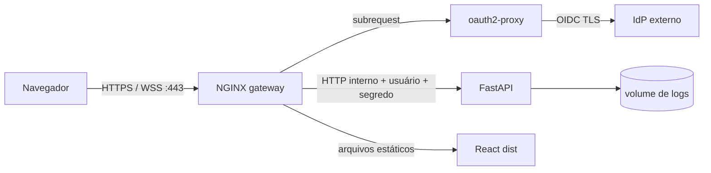

# ADR-0004: Perfil público com proxy como única entrada

## Estado

Aceita para implementação; homologação externa pendente.

## Contexto

O launcher local liga Vite e Uvicorn somente em loopback e aceita, opcionalmente, um
token compartilhado. Isso é adequado ao laboratório local, mas não oferece identidade
individual, TLS, controle de taxa nem uma fronteira operacional para a Internet.

O requisito público é manter a aplicação monolítica, sem reescrever o domínio, e tornar
impossível iniciar um perfil parcialmente protegido. Certificados, credenciais OIDC e
segredos não podem entrar na imagem, no Compose, no repositório ou no navegador.

## Decisão

Adotar o perfil versionado em `deploy/production/`:

1. Apenas o gateway publica portas (`80` para redirecionamento e `443` para TLS).
2. O gateway termina TLS 1.2/1.3, força HSTS, valida o `Host`, aplica limites por IP e
   suporta upgrade WebSocket.
3. Toda UI, API e abertura WebSocket exige uma sessão individual OIDC validada por
   `oauth2-proxy` via `auth_request`. O IdP continua responsável por MFA, ciclo de vida
   de contas e política de acesso.
4. O gateway elimina cabeçalhos fornecidos pelo cliente e injeta dois novos valores:
   usuário obtido da resposta do autenticador e segredo interno de 256 bits.
5. O backend, em `POKER_PUBLIC_DEPLOYMENT=1`, exige ambos em toda rota protegida e em
   todo WebSocket. Também exige origem HTTPS exata, host explícito e token vindo de
   arquivo absoluto regular. Configuração parcial gera erro na inicialização.
6. Certificado, chave, configuração completa do OAuth e segredo proxy-backend são
   arquivos externos fornecidos como Docker secrets. Cada serviço recebe somente os
   segredos de que necessita.
7. A rede `private` não tem entrada nem saída externa. Apenas `oauth2-proxy` recebe uma
   segunda rede de saída para contactar o IdP; backend não publica porta.

## Alternativas consideradas

- **Token compartilhado no navegador:** simples, mas não identifica usuários, torna a
  revogação global e aumenta o risco de vazamento no cliente.
- **JWT/OIDC implementado diretamente no FastAPI:** remove um salto, mas duplica
  descoberta, callback, sessão, renovação e hardening já mantidos pelo oauth2-proxy.
- **Plugin de rate limit no gateway:** permitiria regras distribuídas ou por usuário,
  mas adicionaria build não oficial. O NGINX oficial já oferece `limit_req` e
  `limit_conn` suficientes para uma única instância.
- **TLS automático ACME no mesmo pacote:** reduz operação inicial, mas exige domínio,
  DNS e política de emissão que não existem no checkout. O contrato por arquivos aceita
  certificados de ACME, PKI corporativa ou plataforma gerenciada sem guardar a chave.

## Consequências e trade-offs

- A fronteira fica simples e verificável, mas o IdP e a renovação do certificado passam
  a ser dependências operacionais obrigatórias.
- O limite por IP pode penalizar usuários atrás do mesmo NAT e não é global entre
  réplicas. Escala horizontal exige rate limiter compartilhado/WAF e teste de carga.
- O segredo interno reduz bypass/SSRF acidental, mas deve ser rotacionado reiniciando
  gateway e backend juntos.
- `/health` e `/ready` permanecem públicos **somente na rede privada** para probes. O
  gateway autentica qualquer acesso externo a esses caminhos.
- A política OIDC prova autenticação, não autorização de negócio por mesa. Isolamento de
  dados multiusuário exige introduzir ownership persistente antes de uso multi-tenant.

## Modos de falha

- Segredo ausente/fraco, origem HTTP, wildcard de host ou fonte de token ambígua:
  inicialização bloqueada.
- Sessão ausente/expirada: gateway redireciona para login; backend ainda rejeita caso
  identidade ou segredo não sejam injetados.
- IdP indisponível: novos logins e validações falham fechados.
- Excesso de requisições/conexões: `429` com `Retry-After`.
- Certificado ausente/inválido: NGINX não inicia; não existe fallback HTTP para a app.

## Evidência necessária para homologação

O gate estático não substitui: `docker compose config`, build com SBOM/proveniência,
scan das imagens, validação da configuração do oauth2-proxy, handshake TLS/OCSP,
login/logout/MFA reais, teste WSS, teste de carga/429, restauração do volume e pentest
em ambiente controlado. Essas evidências devem registrar versões e hashes das imagens.

