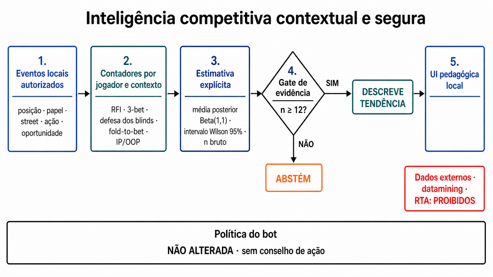

# Mapa sistemático de inteligência competitiva no poker — 2026-08-08

> **Escopo controlado.** Este documento é um mapa sistemático rápido e reproduzível,
> não a alegação impossível de ter indexado “toda a web”. Foram pesquisadas bases
> acadêmicas complementares, literatura primária e políticas oficiais. A implementação
> resultante opera apenas no simulador local, com dados da própria sessão, e não fornece
> assistência em mesas reais.

## Pergunta e decisão

Pergunta: quais técnicas de modelagem competitiva são tecnicamente defensáveis para
enriquecer cada perfil de jogador por posição e papel, sem confundir frequência observada
com força estratégica nem converter a demo em RTA?

Decisão: aplicar agora somente a camada descritiva, contextual, incerta e auditável.
Modelos preditivos, inferência de range e exploração automática continuam como trilhas
experimentais, condicionadas a dataset autorizado, protocolo pré-registrado e avaliação
fora da amostra.

## Protocolo de busca

- Data da busca: 2026-08-08.
- Intervalo: 1998–2026; inglês e português.
- Bases/superfícies: arXiv/UAI, AAAI/AIIDE, PMLR/ICML, NeurIPS, AAMAS, periódico
  *Autonomous Agents and Multi-Agent Systems* e políticas oficiais de PokerStars/GGPoker.
- Consultas principais: `poker opponent modeling Bayesian exploitation`, `poker player
  style clustering position betting features`, `particle filtering dynamic agent poker`,
  `explicit implicit opponent modeling`, `safe opponent exploitation imperfect information`,
  `opponent model search incomplete information`, `AIVAT poker evaluation` e
  `prohibited tools RTA datamining opponent statistics`.
- A busca web foi limitada pelos resultados retornados pelo provedor; ele não expôs um
  total estável por consulta. Por isso, não se apresenta uma falsa contagem censitária.
- O conjunto final contém 23 registros únicos. O pós-processador do skill de revisão
  confirmou 23/23 após deduplicação por DOI/título; o inventário está em
  [`evidence/competitive_intelligence_sources_20260808.md`](evidence/competitive_intelligence_sources_20260808.md)
  e o JSON de origem em
  [`evidence/competitive_intelligence_sources_20260808.json`](evidence/competitive_intelligence_sources_20260808.json).

### Inclusão

1. trabalho primário ou survey revisado por pares sobre modelagem de oponente;
2. aplicação direta a poker/informação imperfeita ou método transferível com limites claros;
3. contribuição para contexto, incerteza, dinâmica, segurança ou avaliação;
4. política vigente publicada pelo próprio operador, quando a pergunta é uso permitido.

### Exclusão

- marketing, blogs de estratégia, fóruns, Wikipédia e páginas SEO;
- tabelas/rótulos de HUD sem definição de oportunidade e denominador;
- “GTO” sem modelagem de oponente;
- datasets sem proveniência suficiente;
- resultados só em domínio distante usados como prova de eficácia em NLHE;
- preprints de 2026 usados como validação consolidada — foram mantidos apenas como horizonte.

## Qualidade e risco de viés

| Evidência | Qualidade para esta decisão | Limite principal |
|---|---|---|
| Billings et al.; Southey et al.; Ponsen et al.; Bard/Bowling; Bard et al. | alta para os princípios de modelagem | variantes/formatos diferentes do NLHE 6-max local |
| Ekmekci/Sirin; Heiberg; Ranca | moderada | workshop, amostras e heads-up; risco de seleção por showdown |
| Johanson/Bowling; Wang et al.; Liu et al.; Li et al.; Ge et al. | alta para o princípio de exploração segura | garantias não transferidas automaticamente ao motor local |
| He et al.; Normoyle/Jensen; Baarslag et al. | moderada e indireta | outros jogos/negociação, não poker NLHE |
| Ganzfried et al.; StratFormer | emergente | Kuhn/Leduc e/ou preprint; não valida NLHE multiway |
| Políticas PokerStars/GGPoker | autoritativa para regras de uso | não mede eficácia científica |

Viés mais importante: ações reveladas em showdown não formam uma amostra aleatória das
mãos privadas. Inferir ranges apenas desses casos super-representa linhas que chegaram ao
fim. Outro risco é não estacionariedade: adversários mudam de estratégia. Por fim, medir
muitas frequências e destacar apenas as “interessantes” cria o problema de múltiplas
comparações; a versão local exibe um conjunto pré-definido e não faz testes de significância
nem dispara ações.

## Taxonomia consolidada

| Família | Técnicas encontradas | Estado na solução |
|---|---|---|
| Estatística descritiva | VPIP, PFR, agressão, WTSD, W$SD, sizing e frequências de resposta | VPIP/PFR/agressão/WTSD/W$SD já existiam; contextos foram ampliados |
| Contexto estratégico | posição, street, ordem IP/OOP, pote/stack, sequência, iniciativa, papel pré-flop | posição exata/região, RFI, limp, isolamento, call/3-bet/4-bet, squeeze, roubo/defesa, blind-vs-blind, fold-to-raise/bet e IP/OOP implementados |
| Probabilística explícita | Beta/Dirichlet, redes bayesianas, posterior sobre estratégias/ranges | Beta(1,1) aplicado às frequências; redes/ranges não promovidos |
| Incerteza e abstenção | intervalos, tamanho efetivo e conjunto plausível de estratégias | n bruto, Wilson 95%, fração operacional de evidência e abstenção n<12 implementados |
| Dinâmica | janela móvel, EWMA, HMM, filtro de partículas, change point | EWMA descritiva implementada; filtros/change point permanecem pesquisa |
| Estilos | regras TAG/LAG, clustering, modelos híbridos, KL entre distribuições | rótulo legado depende de amostra; clustering não aplicado sem dataset |
| Predição | árvores, SVM, ensembles, redes neurais, transformers, embeddings implícitos | não aplicado: falta treino/holdout autorizado e calibração |
| Inferência de crença/range | likelihood de ações, buckets de força, EM para cartas ocultas | não aplicado: seleção dos showdowns e ausência de ground truth suficiente |
| Resposta | best response, portfólio implícito, restricted/safe response, SES | política do bot explicitamente não alterada |
| Avaliação | log-loss/Brier/calibração, cross-play, duplicate deals, AIVAT | testes de contagem/contrato feitos; eficácia estratégica ainda não alegada |
| Governança | dados próprios, identidade estável, retenção, proibição de datamining/RTA | somente sessão local; sem importação/compartilhamento de perfis |

## O que foi implementado

Cada jogador do modo Laboratório recebe um perfil `ci-local-v1`, indexado pelo
`player_id` imutável. O perfil expõe:

1. oportunidade e sucesso brutos para RFI/open-raise, limp, isolamento, call/3-bet/4-bet,
   squeeze, tentativa/defesa de roubo, blind-versus-blind, fold diante de raise/bet e
   agressão IP/OOP;
2. VPIP/PFR globais, por região e por posição exata (UTG, UTG+1, MP, LJ, HJ, CO,
   BTN, SB e BB);
3. frequência observada, média posterior Beta(1,1) e intervalo Wilson 95%;
4. `insufficient`, `emerging` ou `stable`, com abstenção operacional antes de 12
   oportunidades e fração operacional de evidência igual a 1 somente a partir de 30;
5. EWMA de agressão comparada à taxa de longo prazo, descrita como sinal heurístico;
6. posição exata da mão atual e explicação metodológica na UI;
7. `scope=local_session_only` e `authority=descriptive_only_no_action_advice` no contrato.

O limiar 12/30 é uma escolha operacional transparente para a demonstração, não constante
universal do poker nem resultado de power analysis. O intervalo Wilson descreve a
frequência amostral; ele não é apresentado como intervalo credível do posterior. A média
posterior e o intervalo pertencem a estruturas inferenciais diferentes e permanecem
nomeados separadamente no JSON.

### Leitura posicional do arquivo fornecido

O anexo descreve corretamente uma assimetria estrutural: BTN/CO/HJ tendem a conservar
vantagem de ordem pós-flop; SB e frequentemente BB jogam fora de posição; UTG age primeiro
pré-flop e há mais jogadores por falar. Isso justifica **segmentar observações**, não
prescrever ranges ou concluir que um raise específico “prova força”. A solução converteu
cada posição em perguntas auditáveis:

| Posição/papel | O que é observado | O que não é inferido |
|---|---|---|
| UTG/UTG+1 | RFI, limp, PFR/VPIP exatos, resposta a raise | força extrema ou range privado |
| MP/LJ | abertura, limp, isolamento e resposta a ação anterior | qualidade da mão |
| HJ/CO/BTN | RFI e, para CO/BTN, tentativa de roubo em pote fechado | lucratividade universal do roubo |
| SB | tentativa de roubo, abertura blind-vs-blind, defesa/3-bet/fold | obrigação de jogar ou range recomendado |
| BB | defesa geral, fold diante de roubo e defesa BB-vs-SB | “defender sempre” por já ter fichas no pote |
| qualquer posição | call, 3-bet, squeeze, 4-bet e IP/OOP pós-flop quando elegível | intenção, blefe, tilt ou causalidade |

Ranca inclui posição, tamanho do pote, razão raise/pote e histórico pré-flop entre features
de detecção de bluff, mas isso não autoriza importar seu classificador: o estudo tem outro
dataset e objetivo. Nesta versão, posição e papel permanecem estratos descritivos, e os
denominadores pequenos continuam abstidos.

## O que deliberadamente não foi aplicado

- **Transformer/embedding/opponent head:** os resultados recentes são promissores em
  Leduc ou outros ambientes, mas não existe checkpoint validado no nosso estado NLHE.
- **Filtro de partículas/HMM/change point:** exige modelo de transição, calibração e
  comparação prospectiva; a EWMA atual é apenas um resumo de recência.
- **Range por cartas mostradas:** o conjunto de showdowns é seletivo; sem EM/ground truth
  e holdout, a confiança seria enganosa.
- **Clusters TAG/LAG automáticos:** sem amostra populacional e validação, rótulos podem
  reificar thresholds arbitrários. Estilos híbridos são mais plausíveis que uma classe fixa.
- **Best response automático:** uma leitura errada pode tornar o próprio agente mais
  explorável. Nenhuma estimativa desta camada altera a política.
- **Datamining, perfis compartilhados e RTA:** incompatíveis com o escopo pedagógico e
  proibidos por políticas oficiais relevantes.

## Fontes nucleares

- [Billings et al., Opponent Modeling in Poker (AAAI 1998)](https://cdn.aaai.org/AAAI/1998/AAAI98-070.pdf)
- [Southey et al., Bayes' Bluff](https://arxiv.org/abs/1207.1411)
- [Bard e Bowling, Particle Filtering (AAAI 2007)](https://f.aaai.org/Library/AAAI/2007/aaai07-081.php)
- [Bard et al., Online Implicit Agent Modelling (AAMAS 2013)](https://aamas.csc.liv.ac.uk/Proceedings/aamas2013/docs/p255.pdf)
- [Ekmekci e Sirin, features e ensembles (AAAI 2013)](https://cdn.aaai.org/ocs/ws/ws1059/7132-30507-1-PB.pdf)
- [Heiberg, redes bayesianas e viés de showdown (AAAI 2013)](https://cdn.aaai.org/ocs/ws/ws1085/7160-30514-1-PB.pdf)
- [Wang et al., segurança versus exploração](https://ojs.aaai.org/index.php/AAAI/article/view/7981)
- [Liu et al., Safe Opponent-Exploitation Subgame Refinement](https://proceedings.neurips.cc/paper_files/paper/2022/hash/b12a1d1014e952e676f5d6931d03241a-Abstract-Conference.html)
- [Li et al., Opponent-Model Search (AAAI 2024)](https://ojs.aaai.org/index.php/AAAI/article/view/28844)
- [Ranca, features para detecção de bluff em NLHE (AAAI 2013)](https://cdn.aaai.org/ocs/ws/ws1038/7109-30520-1-PB.pdf)
- [Johanson e Bowling, Data Biased Robust Counter Strategies](https://proceedings.mlr.press/v5/johanson09a.html)
- [Ponsen et al., Bayes-relational learning em NLHE](https://cdn.aaai.org/AAAI/2008/AAAI08-244.pdf)
- [Ge et al., Safe and Robust Subgame Exploitation (ICML 2024)](https://proceedings.mlr.press/v235/ge24b.html)
- [He et al., explicit/implicit deep opponent modeling (ICML 2016)](https://proceedings.mlr.press/v48/he16.html)
- [Burch et al., AIVAT](https://ojs.aaai.org/index.php/AAAI/article/view/11481)
- [StratFormer — preprint, somente horizonte](https://arxiv.org/abs/2604.25796)
- [PokerStars — ferramentas/RTA/datamining](https://www.pokerstars.com/pt-BR/poker/room/prohibited/)
- [GGPoker — Security & Ecology Policy](https://legal.ggpoker.com/network/security-ecology-policy/)

## Avaliação futura necessária para promoção preditiva

Pré-registrar unidade de análise, hipóteses e métricas antes de observar resultados;
separar jogador/sessão/tempo entre treino e teste; comparar baseline global, contexto,
recência e modelo proposto; medir log-loss, Brier, calibração e cobertura/abstenção;
executar cross-play com assentos e deals pareados; controlar comparações múltiplas;
reportar ICs e pior confronto. Ganho em previsão não autoriza automaticamente exploração:
o efeito sobre retorno e risco precisa de uma avaliação separada.

## Conclusão proporcional à evidência

A solução agora implementa uma base competitiva explicável e defensável para a banca:
quem fez o quê, em qual contexto, com quantas oportunidades e quanta incerteza. Ela não
prova que “leu a mente” do jogador, não estima cartas privadas e não afirma vantagem
estratégica. Essa separação entre observado, inferido e ainda não validado é precisamente
o que torna o recurso cientificamente apresentável.
