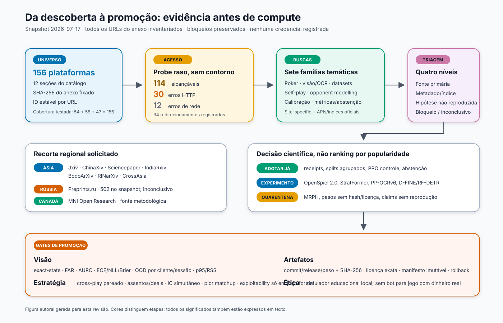

# Varredura de 156 plataformas para a Poker Arena — 2026-07-17

> **Evidência datada.** O estado implementado em 2026-08-08 — perfis contextuais locais,
> posicionais, descritivos e sem autoridade de ação — está em
> [`COMPETITIVE_INTELLIGENCE_20260808.md`](COMPETITIVE_INTELLIGENCE_20260808.md). Recomendações
> futuras deste snapshot continuam futuras salvo evidência explícita em documento posterior.

> **Snapshot reproduzível, não censo eterno nem benchmark de produção.** Todos os 156 URLs
> oficiais do catálogo fornecido foram inventariados e sondados. A busca de conteúdo foi feita
> em cada serviço que expunha pesquisa pública utilizável e, nos agregadores, por famílias
> temáticas reproduzíveis. Serviços legados, diretórios, shells JavaScript, paywalls, CAPTCHA,
> `robots`, `403`, `429` e falhas de rede foram registrados sem contorno. “Sem ativo retido” não
> significa “não existe no acervo”.

## Resultado executivo

A varredura não encontrou um peso pronto que possa substituir com segurança os modelos atuais.
Ela encontrou melhorias de método mais importantes do que uma troca cega de arquitetura:

1. **PPO passa a ser o controle obrigatório da trilha estratégica.** A versão v4 do estudo
   [Reevaluating Policy Gradient Methods for Imperfect-Information Games](https://arxiv.org/abs/2502.08938v4),
   publicada no ICLR 2026, relata mais de 7.000 runs em cinco jogos e não encontrou vantagem dos
   métodos deep-RL derivados de FP/DO/CFR sobre policy gradients genéricos. Os próprios autores
   alertam que quatro dos cinco jogos são homogêneos, que o ranking não é universal nem entre os
   cinco e que tuning/orçamento limitam a conclusão. Portanto PPO é **controle**, não superioridade
   transferida; PSRO continua challenger.
2. **PHH v3 é a maior coleção histórica de poker encontrada**, útil para parser, replay, contratos de
   regras e opponent modelling, com deduplicação e split por fonte/jogador/sessão/tempo. O
   [registro oficial](https://zenodo.org/records/17136841) declara mais de 21,6 milhões de mãos
   humanas NLHE, dados ACPC e 10 mil mãos Pluribus. As mãos humanas são de 1–23 de julho de
   **2009**; qualquer modelo comportamental exige holdout moderno, autorizado e externo.
3. **O gargalo de visão permanece um corpus real autorizado de screenshots.** MRPH fica em
   quarentena por conflito de licença, leakage provável e desvio físico→UI. Poker Cards FMJIO é
   apenas challenger. Nenhum dataset encontrado demonstra generalização entre clientes, temas,
   escalas e sessões do jogo.
4. **Calibração e abstenção viram gates de primeira classe.** Exact-state, false-accept rate,
   risco-cobertura/AURC, NLL, Brier, ECE adaptativa, OOD por grupo e latência p95 importam mais
   que mAP ou acurácia isoladas.
5. **OpenSpiel 2.0 é a melhor trilha formal isolada**, não um motor substituto. A versão 2.0 foi
   publicada em 2026-07-14 e o projeto explicita históricos e chance nodes; isso habilita Kuhn,
   Leduc e exploitability verificável antes de extrapolar conclusões ao motor local. A tag `v2.0`
   foi resolvida ao commit `6a1458e8a7d52b1f38265fc7ed85cfb1a3dbc85f`; o HEAD observado
   pertence a outra revisão e não é usado como recibo da release.
6. **A busca regional não trouxe um modelo de poker promovível.** Ásia, Índia, Rússia e Canadá
   produziram sobretudo métodos indiretos, shells/erros ou itens fora de domínio. Isso é um
   resultado útil: impede que origem regional ou contagem do índice seja confundida com aderência.

## Cobertura auditável

O anexo `plataformas_concorrentes_equivalentes_arxiv (3).md` foi fixado pelo SHA-256
`8f411d8bac4d6f0ac4103d7eb9593406bd84b758e9ecc6e28dd8bc6364a08204`. O inventário canônico
está em [`platform_inventory.json`](evidence/platform_inventory.json); o gerador e seus testes
estão no backend.

| Evidência | Cobertura | Resultado |
|---|---:|---|
| Inventário | 156/156 | 12 seções, URLs deduplicados, IDs estáveis |
| Probe raso | 156/156 | 114 alcançáveis, 30 erros HTTP, 12 erros de rede |
| Status HTTP | 156/156 | 110×200, 4×202, 24×403, 2×302, 2×405, 1×404, 1×500, 12 sem resposta HTTP |
| Redirecionamentos | 34 | URL final preservada no receipt |
| Sweep 1–4 | 54/54 | 34 acessíveis/parciais; 20 limitadas; 9 fontes com sinal técnico alto/acionável |
| Sweep 5–8 | 55/55 | 45 follow-ups, 172 blocos brutos, 15 evidências retidas |
| Sweep 9–12 | 47/47 | sete temas em sete índices, mais inspeção de repositórios/legados/diretórios |
| Teste de união | 156/156 | zero ausentes, extras, IDs ou URLs duplicados |

As taxonomias de acesso dos três sweeps não são somadas entre si: “shell JavaScript” e
“redirecionamento útil”, por exemplo, têm significado diferente de HTTP 200. O probe raso só
prova resposta do URL; não prova que texto integral ou busca interna estavam acessíveis.

Auditoria item a item e receipts estruturados:

- [Seções 1–4 — relatório](evidence/platform_sweep_sections_1_4.md) e
  [JSON](evidence/platform_sweep_sections_1_4.json);
- [seções 5–8 — relatório](evidence/platform_sweep_sections_5_8.md) e
  [JSON](evidence/platform_sweep_sections_5_8.json);
- [seções 9–12 — relatório](evidence/platform_sweep_sections_9_12.md) e
  [JSON](evidence/platform_sweep_sections_9_12.json);
- [triagem primária de candidatos](evidence/primary_candidate_findings.json);
- [suplemento regional Ásia/Canadá/Rússia/Índia](evidence/regional_platform_supplement_20260717.md)
  e seu [receipt JSON](evidence/regional_platform_supplement_20260717.json);
- [tentativas inválidas da API do arXiv](evidence/arxiv_api_attempts_status.json).

## Método de busca e limites

Foram usadas sete famílias, em inglês e, quando relevante, termos locais/transliterados:

1. `poker`, `Texas Hold'em`, `poker AI`;
2. `imperfect-information game`, `self-play`, `PPO`, `CFR`, `PSRO`, `ReBeL`;
3. `opponent modeling`, `belief model`, `player adaptation`;
4. `playing-card detection`, `rank suit classification`, `OCR`, `screen parsing`;
5. `calibration`, `conformal`, `selective prediction`, `abstention`, `risk coverage`;
6. `dataset`, `weights`, `checkpoint`, `source code`, `benchmark`;
7. `human factors`, `decision support`, `override`, `uncertainty communication`.

HAL, Zenodo, OpenReview, OSF, Figshare, OpenAlex, Crossref, Semantic Scholar, DBLP, CORE,
HF Papers e Europe PMC receberam consultas por API/índice público quando disponíveis. Contagens
entre índices não são comparáveis: Crossref casa tokens em metadados e produz universos muito
amplos; Semantic Scholar bulk não é ranking de relevância; HF limitou lotes; CORE trouxe
duplicatas; Europe PMC é deliberadamente desalinhado para poker.

A API Atom do arXiv devolveu quatro `429` e três timeouts. O helper inicialmente escreveu listas
vazias sem expor o erro; por isso todos esses zeros foram marcados como receipts inválidos e a
busca continuou em páginas oficiais do arXiv. BASE devolveu Security Check/`Access denied`;
OpenReview às vezes apresentou browser challenge; Google Scholar, Academia.edu, ResearchGate,
Dimensions e Lens não foram raspados nem autenticados.

## Plataformas asiáticas, indianas, russas e canadenses

O recorte abaixo usa somente afiliação explicitamente identificável no catálogo ou no serviço;
plataformas globais não foram “regionalizadas” por inferência.

| Região | Plataformas auditadas | Acesso/busca observados | Resultado útil |
|---|---|---|---|
| Japão | [Jxiv](https://jxiv.jst.go.jp/) | aberta; três buscas em japonês/inglês | um preprint indireto sobre OCR local/isolado; nenhum peso/dataset de poker |
| China | [ChinaXiv](https://chinaxiv.org/home.htm), [Sciencepaper Online](https://www.paper.edu.cn/) | busca EN/CN; resultados de CV, RL, pipeline e calibração | métodos fora de domínio; nenhum artefato de poker promovível |
| Índia | [IndiaRxiv](https://ops.iihr.res.in/index.php/IndiaRxiv), BodoArXiv | OJS/página direta ou catálogo especializado; buscas poker/ML | nenhum bloco estreito promovível |
| Ásia regional | CrossAsia, RINarXiv/Indonésia | acesso limitado/legado em parte do snapshot | nenhum ativo retido; cobertura inconclusiva onde bloqueado |
| Rússia | [Preprints.ru](https://preprints.ru/) | `502` no snapshot; consulta externa delimitada sem contorno | inconclusivo, nunca contado como zero |
| Canadá | [MNI Open Research](https://mniopenresearch.org/) | acesso direto; dois blocos de benchmark/robustez | padrões de validação, não transferência de neuroimagem para poker |

Na Jxiv foram pesquisados `ポーカー`, `テキサスホールデム`, `不完全情報ゲーム`, `自己対戦`,
`対戦相手モデリング`, `光学文字認識`, `画像認識` e `キャリブレーション`. ChinaXiv e
Sciencepaper receberam termos de CV/OCR/RL/calibração; IndiaRxiv e Preprints.ru receberam
follow-up de machine learning/poker. Uma segunda rodada fora do catálogo acrescentou J-STAGE,
CiNii, KoreaScience, CPRG/University of Alberta, HSE, CyberLeninka, IIT Kanpur, IIT Bombay e
IIM Kozhikode. Ela reteve duas técnicas acionáveis: separar transições de exploração da memória
supervisionada do NFSP e avaliar futuramente AIVAT. Na HSE, uma tese trouxe somente alegações de
LLM; uma segunda apontou para um fork público com DDQN/DeepSeek. A auditoria estática do commit e
checkpoint encontrou crédito atribuído apenas à última ação, target stale após load, prioritized
replay mal ponderado e treino durante a avaliação; portanto o peso ficou em quarentena. O IIT
Bombay acrescentou uma arquitetura patenteada de Rummy, sem artefato aberto ou benchmark de poker.
Consultas indianas também revelaram páginas de cassino/SEO em subcaminhos acadêmicos; foram
descartadas como provável index poisoning. O [suplemento regional](evidence/regional_platform_supplement_20260717.md)
preserva evidência, inferência e decisão separadamente.

## Dados e datasets

Uma nova execução pública e sem credenciais está preservada no
[receipt Kaggle/Hugging Face de 2026-07-18 UTC](evidence/catalog_search_snapshot_20260718.md):
81 datasets e 104 modelos únicos no HF, 67 datasets no Kaggle; as cinco consultas ao
endpoint Kaggle Code receberam `401` e foram marcadas como inconclusivas. Esses números
são cobertura das consultas registradas, não um censo nem uma validação dos candidatos.

### Adotar para auditoria/experimento

| Fonte | Valor real | Gate antes de uso |
|---|---|---|
| [PHH v3](https://zenodo.org/records/17136841) | replay, parser, invariantes, comportamento histórico | commit/arquivo/hash; licença por subfonte; dedup; split fonte×jogador×sessão×tempo; humanos ≠ GTO |
| [takara-ai/poker_hands](https://huggingface.co/datasets/takara-ai/poker_hands) | acesso Parquet/streaming ao universo PHH | reconciliar revisão, amostras, schema e hashes com o registro oficial |
| [PokerBench](https://huggingface.co/datasets/RZ412/PokerBench) | warm-start e action-agreement auxiliar | revisão imutável; detectar leakage; nunca substituir cross-play/bb/100 |
| [Kaggle Poker Heads-Up](https://www.kaggle.com/datasets/kaggle/poker-heads-up) | OOD e diversidade de estilos | mãos espelhadas no mesmo split; não tratar como solver/GTO |

### Challenger ou quarentena

O [MRPH](https://www.kaggle.com/datasets/arnaudlewandowski/mandines-real-poker-hands-mrph-dataset)
tem 2.277 imagens físicas de mãos completas, mistura quatro fontes e declara CC BY 4.0 nos
metadados, mas CC BY-NC 4.0 no README. A distribuição quase balanceada por classe não representa
frequências naturais. Até resolver licença/proveniência, agrupar fonte/sessão/baralho/fundo e
demonstrar ganho em screenshots externos, seu status é **quarentena**.

[Poker Cards FMJIO](https://universe.roboflow.com/roboflow-jvuqo/poker-cards-fmjio) é mais
próximo da tarefa rank/suit por carta, mas imagens fonte e augmentations devem ficar no mesmo grupo.
Datasets físicos podem pré-treinar representação; não podem certificar leitura de UI. O ativo
decisivo continua sendo um corpus próprio/autorizado de screenshots com estado completo e splits
por cliente, sessão, tema, deck, resolução e cadeia de transformação.

## Modelos, algoritmos e parâmetros

### Estratégia

| Candidato | Evidência | Decisão para o projeto |
|---|---|---|
| PPO | benchmark ICLR 2026 com >7.000 runs em jogos formais | **controle obrigatório** depois do encoder v2; não promoção automática |
| OpenSpiel 2.0 | Apache-2.0; jogos/algoritmos/métricas formais | trilha isolada Kuhn/Leduc, exact exploitability e differential tests |
| NFSP com provenance de exploração | [JSAI 2018, Leduc](https://www.jstage.jst.go.jp/article/pjsai/JSAI2018/0/JSAI2018_1N301/_article/-char/en) | ablação formal: não contaminar average-policy buffer com ações exploratórias; não copiar `epsilon` |
| AIVAT | [AAAI 2018](https://ojs.aaai.org/index.php/AAAI/article/view/11481) | challenger de redução de variância somente após chance history, política conhecida e value estimate validados |
| PSRO/SP-PSRO | [SP-PSRO, ICLR 2024](https://openreview.net/forum?id=J2TZgj3Tac) | challenger somente depois de PPO e inicialmente em dois jogadores zero-sum |
| StratFormer | [Computers and Games 2026](https://arxiv.org/abs/2604.25796v1) | challenger de history/opponent head; Leduc apenas, sem peso pinado verificado |
| EVPA | [ICLR 2025](https://proceedings.iclr.cc/paper_files/paper/2025/hash/8c1b5863a6b0f925617b917bb2f55be0-Abstract-Conference.html) | reproduzir em jogo pequeno antes de qualquer pruning; não remover ações silenciosamente |
| TurboReBeL | [registro OpenReview](https://openreview.net/forum?id=yMo7Z670f6) listado como submissão ICLR 2026 | quarentena: alegação de ~250×, quatro A100, sem reprodução/código local verificado |
| RLCard/PettingZoo | baseline comum, ação NLHE abstrata em cinco opções | adapter/smoke; nunca oráculo de regras/bet sizing |
| PokerRL | referência histórica MIT, stack antigo | leitura; fork somente após reproduction gate |

O repositório oficial do estudo IIG foi fixado no commit
`591d35dadf243df846534c9df9f77759f7441814`; o submódulo esperado é
`2d83a358f716ee8512c4cd55ca609f794b08f1a2`. Não foi observado LICENSE/COPYING na raiz:
o código visível não deve ser reutilizado sem uma licença explícita. `exp-a-spiel` foi observado no
HEAD `9412882c24e521fad7cbd96fdd68311d9bf6f203`, com licença MIT no blob
`9cf106272ac3b56b0c4c80218e8fc10a664ca5f4`. ReCoVERR foi observado em
`0cbd88de4e5782dc16092ad3dad82a33544ce827`, sem LICENSE/COPYING na raiz; sua
arquitetura pode inspirar desenho, mas o código não tem grant de reutilização inferido.

Parâmetros publicados são **centros de sweep, não defaults transferíveis**:

| Origem/jogo | Parâmetros observados | Uso permitido |
|---|---|---|
| IIG benchmark / Liar's Dice PPO | LR `6.25e-5`, clip `0.025`, entropia `0.1`, γ `0.99`, GAE λ `0.95`, 8 envs×256 passos, 1 minibatch, 8 épocas, VF `0.0625` | sanity check no jogo de origem; nunca copiar para NLHE |
| Big 2 PPO v2 | LR `3e-5`, clip `0.2`, γ `0.99`, λ `0.95`, 4 épocas | ablação orientativa; as tabelas usam em geral um seed e não reportam incerteza |
| IIG benchmark / Liar's Dice PSRO | oracle DQN, 3×512, 4.000 episódios, 250 simulações/entrada, LR `0.08` | apenas reprodução isolada; não baseline do Expert |
| IIG benchmark / Liar's Dice R-NaD | 3×512, batch 32, LR `1e-4`, `eta=0.1`, V-trace | somente challenger formal |

O benchmark IIG mistura Torch 2.4.1, TensorFlow 2.15, Ray 2.37 e JAX 0.4.27 e declara ambiente
Pixi Linux-only/NumPy&lt;2. Qualquer reprodução deve ficar em container/ambiente separado, sem
contaminar o runtime NumPy 2 do projeto.

### Visão e OCR

O roadmap visual anterior permanece coerente: PP-OCRv6 tiny/small como challengers de OCR;
D-FINE-N e RF-DETR Nano como challengers de detecção; classificador rank/suit separado após crop;
OCR somente em ROIs numéricas; decoder estrutural e consenso temporal antes de aceitar o estado.
Nenhum checkpoint remoto entra por nome: é obrigatório pin de commit/release, hash do peso,
pré/pós-processamento, dicionário, licença do artefato exato e paridade Python↔ONNX.

O trabalho de [calibração clássica](https://arxiv.org/abs/1706.04599) mantém temperature scaling
como baseline pós-hoc, não solução OOD. [Selective Conformal Risk Control](https://arxiv.org/abs/2512.12844)
é challenger, mas suas garantias dependem de exchangeability; grupos cliente/sessão/tema violam
IID se o split for ingênuo. [ReCoVERR](https://arxiv.org/abs/2402.15610) inspira busca seletiva de
evidência, não autoriza substituir schemas/regras determinísticos por VQA nem reutilizar código
sem licença explícita.

## Features e arquitetura propostas

### Encoder estratégico v2

- histórico tokenizado de ações, rua, tamanho em bb e posição relativa;
- stack por assento, stack efetivo, SPR, pot/side pots e jogadores ativos/all-in;
- agressor/último full raise, raises por rua e estado de reabertura;
- máscara legal derivada exclusivamente do motor;
- opponent head separado, com contexto por bucket e incerteza;
- `encoder_version`, schema e hash dentro do manifesto do checkpoint.

Estados diferentes não podem colidir silenciosamente. Antes de treinar, um teste property-based
deve gerar pares de histórias estrategicamente distintas e medir colisões do encoder.

### Visão/capture v2

- detector genérico de ROIs → crop/retificação → rank/suit + OCR numérico;
- features de qualidade: resolução efetiva, blur, contraste, compressão, oclusão e estabilidade;
- decoder estrutural rejeitando carta duplicada, street/pot/bet impossível e conflito temporal;
- calibração por campo e por domínio; abstenção explícita com motivo;
- provenance por screenshot/ROI/frame e pHash para impedir leakage.

### Copiloto

Os achados de human factors recomendam separar:

1. probabilidade/equity estimada;
2. preferência/objetivo do usuário;
3. ação legal e restrições do motor;
4. confiança, cobertura e motivo de abstenção;
5. recomendação final e alternativas.

O sistema deve registrar contexto e override sem atribuir causalidade psicológica. Automação é
seletiva: baixa confiança, estado incompleto, conflito entre frames ou erro estrutural devolvem
pedido de confirmação. O copiloto permanece local, educacional e pós-jogo, limitado a sessões
próprias ou expressamente autorizadas e a ambientes sem dinheiro real. Captura ou análise remota
exige consentimento explícito, redaction antes do envio, transporte autenticado, não persistência e
direito de exclusão. Não há recomendação nem automação para plataforma de dinheiro real.

## Métricas e gates

| Trilha | Métrica primária | Métricas obrigatórias | Split/gate |
|---|---|---|---|
| Estado visual | exact-state | FAR, coverage, AURC, NLL, Brier, ECE adaptativa, per-field, p50/p95, RSS | cliente×sessão×tema×deck×resolução; OOD completo |
| Detector | mAP50-95 e erro por classe | recall de carta/ROI crítica, PR curves, latência | grupos fonte/vídeo/augmentation; screenshot holdout real |
| OCR | exact-field/CER | falsa leitura, abstenção, valor numérico absoluto/relativo | cliente×fonte×escala×blur×compressão |
| Estratégia | bb/100 pareado/cross-play | IC bootstrap, pior matchup, assento, duplicate deals, exploitability em jogo formal | seeds independentes; controles congelados; sem PokerBench-only |
| Opponent model | NLL/Brier + ganho cross-play | calibração por arquétipo, shift temporal, safety loss vs baseline | oponentes não vistos; janela temporal; ablação sem exploração |
| Sistema | sucesso end-to-end | 4xx/5xx, cancelamento, memória, cold start, paridade ONNX | backend+frontend reais; E2E e regressão de contrato |

Promoção exige desenho pré-registrado com ID, unidade de bloco, MDE e margem de não inferioridade
justificada; pelo menos 30 blocos pareados independentes; ICs simultâneos com FWER controlado;
precisão observada compatível com o MDE; limite inferior agregado acima de zero; nenhuma regressão
crítica por grupo; artefatos imutáveis e rollback. Sem pré-registro ou sem precisão, o gate falha
fechado — não existe margem universal pós-hoc de `-5 bb/100`. Exact exploitability só pode ser
alegada no adaptador formal que preserva chance nodes, histórico e informação; desempenho 6-max
não será chamado de GTO.

## Roadmap priorizado

### Adotar agora

1. Manter receipts de consulta, SHA-256, versão, licença e decisão de inclusão.
2. Construir o encoder v2 e seu teste de colisões antes de novo treino.
3. Tornar PPO o controle e congelar protocolo cross-play pareado.
4. Coletar/rotular corpus real autorizado e aplicar split agrupado/pHash.
5. Adicionar calibration/abstention/decoder estrutural ao gate visual.
6. Usar OpenSpiel 2.0 em ambiente isolado para Kuhn/Leduc/exploitability.
7. Registrar behavior-policy/exploração no replay e preparar a ablação NFSP regional.

### Benchmark controlado

1. PPO atual versus current-policy/league/checkpoint, um fator por vez.
2. StratFormer-style history head versus modelo sem opponent head.
3. PP-OCRv4×v6 e YOLO11n×D-FINE-N×RF-DETR Nano no mesmo hardware/corpus.
4. Poker Cards FMJIO apenas como pré-treino/challenger.
5. Temperature scaling versus calibração seletiva/grupo-consciente.
6. Duplicate deals/controle atual versus AIVAT, somente na trilha formal verificável.

### Quarentenar ou rejeitar

- MRPH até a licença/proveniência e o leakage serem resolvidos;
- qualquer peso sem revisão/hash/licença/preprocessamento exatos;
- parâmetros de Liar's Dice/Big 2 copiados como defaults NLHE;
- TurboReBeL/LLM poker/self-play claims sem código e reprodução independente;
- Papers with Code como dependência ativa: hoje redireciona para HF Papers;
- scraping de serviços com CAPTCHA/login/`robots`/rate limit;
- uso de API/dados do GTO Wizard para treino, distillation ou calibration.

## Done condition experimental

Nenhuma GPU Modal foi acionada: não há corpus visual congelado nem encoder v2 que justifiquem o
custo. O próximo job remoto só deve existir depois de dataset+manifesto+baseline+gate locais
imutáveis. A primeira medição deve comparar CPU/T4/L4/L40S/A100 em probe curto e interromper se
import, revisão, hash, schema ou métrica divergir. Hardware mais caro não corrige experimento mal
especificado.

Esta revisão acrescenta descoberta e critérios de decisão; não fabrica ganho. Até uma execução
local pareada passar todos os gates, cada novo modelo, dataset, técnica ou parâmetro permanece
**candidato**, nunca melhoria comprovada da Poker Arena.
